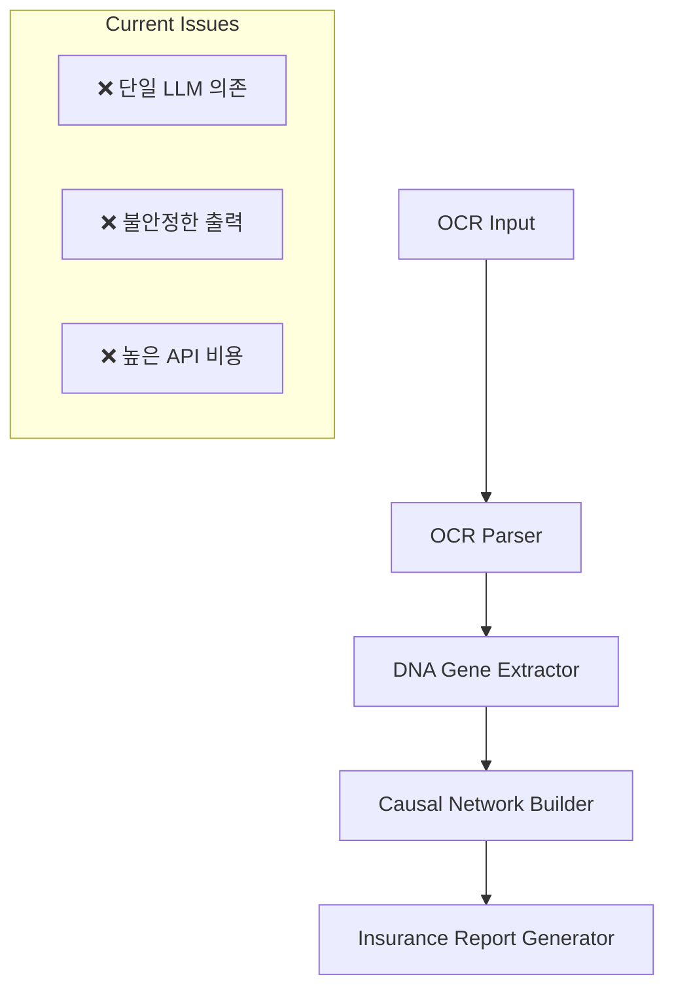
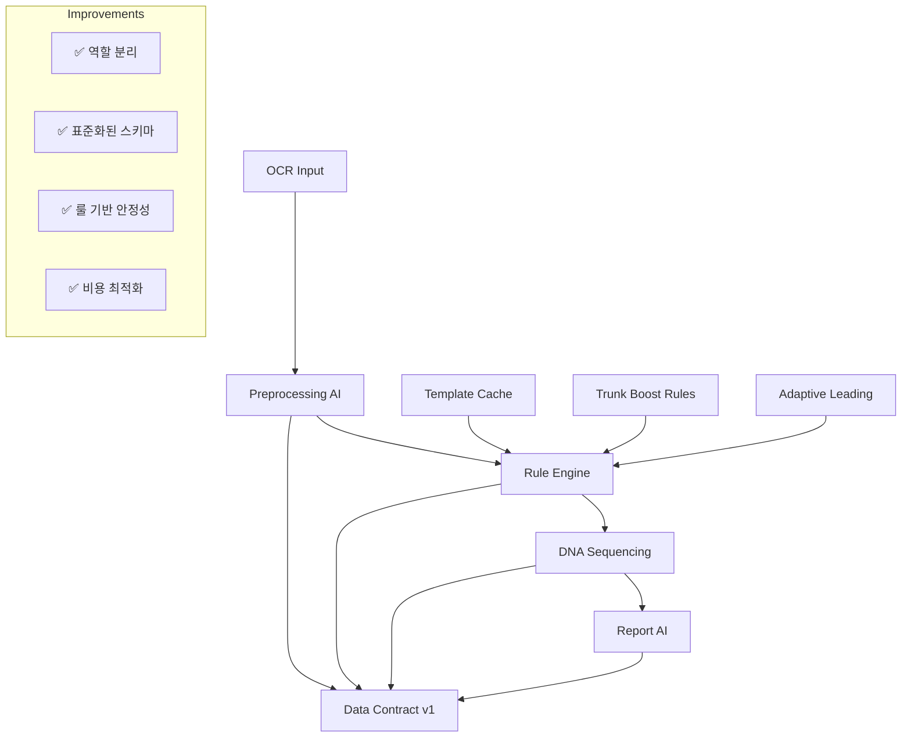
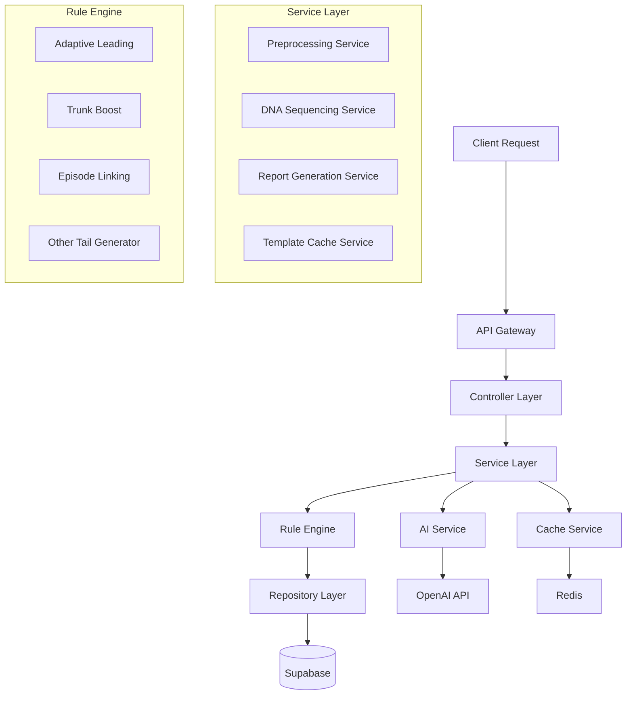
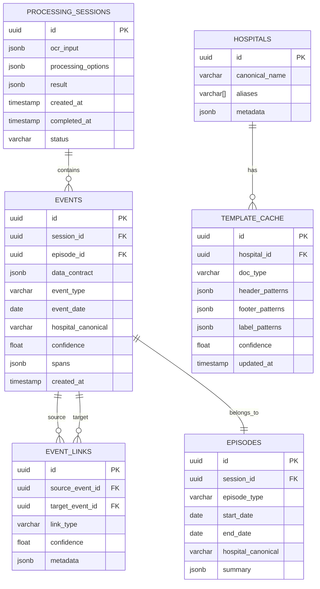

# VNEXSUS 기술 아키텍처 개선안

## 1. 아키텍처 설계

### 1.1 현재 아키텍처


### 1.2 개선된 아키텍처


## 2. 기술 스택 정의

### 2.1 Core Technologies
- **Frontend**: React@18 + TypeScript + Tailwind CSS
- **Backend**: Node.js + Express + TypeScript
- **Database**: Supabase (PostgreSQL)
- **Cache**: Redis
- **AI/ML**: OpenAI GPT-4o-mini
- **Configuration**: YAML + JSON Schema

### 2.2 New Dependencies
```json
{
  "dependencies": {
    "@types/js-yaml": "^4.0.5",
    "js-yaml": "^4.1.0",
    "redis": "^4.6.0",
    "ajv": "^8.12.0",
    "zod": "^3.22.0"
  }
}
```

## 3. 라우트 정의

| Route | Purpose | Method |
|-------|---------|--------|
| `/api/v1/process` | 문서 처리 메인 엔드포인트 | POST |
| `/api/v1/preprocess` | 전처리 AI 단독 실행 | POST |
| `/api/v1/rules/apply` | 룰엔진 단독 실행 | POST |
| `/api/v1/dna/sequence` | DNA 시퀀싱 단독 실행 | POST |
| `/api/v1/report/generate` | 보고서 생성 단독 실행 | POST |
| `/api/v1/templates` | 템플릿 캐시 관리 | GET/POST/PUT |
| `/api/v1/config/rules` | 룰 설정 관리 | GET/POST |
| `/api/v1/health` | 시스템 상태 확인 | GET |

## 4. API 정의

### 4.1 Data Contract v1 스키마

```typescript
interface DataContractV1 {
  // 날짜 정보
  date: {
    raw: string;
    iso?: string;
    candidates: string[];
    confidence: number;
  };
  
  // 병원 정보
  hospital: {
    raw: string;
    canonical?: string;
    candidates: string[];
  };
  
  // 진료과
  dept?: {
    raw: string;
    canonical?: string;
  };
  
  // 방문 유형
  visitType: {
    raw: string;
    canonical?: string;
  };
  
  // 진단
  dx: {
    raw: string[];
    code3?: string;
    candidates: string[];
  };
  
  // 검사/시술/약물
  tests: MedicalItem[];
  procedures: MedicalItem[];
  meds: MedicalItem[];
  
  // 노트
  notes: {
    raw: string;
    tags: ('LOW-LINK' | 'ADMIN' | 'CONTEXT')[];
    spans: Span[];
  };
  
  // 트렁크 힌트
  trunkHint: ('CANCER' | 'NEURO' | 'CARDIO' | 'DEATH' | 'SURGERY' | 'MRI')[];
  
  // 근거
  evidence: {
    spans: Span[];
  };
  
  // 플래그
  flags: string[];
}

interface MedicalItem {
  raw: string;
  canonical?: string;
  attrs?: Record<string, any>;
  confidence: number;
  spans: Span[];
}

interface Span {
  start: number;
  end: number;
  text: string;
  page?: number;
  line?: number;
}
```

### 4.2 메인 처리 API

```
POST /api/v1/process
```

**Request:**
| Param Name | Param Type | Required | Description |
|------------|------------|----------|-------------|
| ocrResult | VisionOcrResult | true | Google Vision OCR 결과 |
| options | ProcessOptions | false | 처리 옵션 |

**Response:**
| Param Name | Param Type | Description |
|------------|------------|-------------|
| success | boolean | 처리 성공 여부 |
| data | ProcessedResult | 처리 결과 |
| processingTime | number | 처리 시간 (ms) |
| stats | ProcessingStats | 처리 통계 |

**Example Request:**
```json
{
  "ocrResult": {
    "fullTextAnnotation": {
      "text": "2024-01-15 서울대병원 내과...",
      "pages": [...]
    }
  },
  "options": {
    "enableTemplateCache": true,
    "enableTrunkBoost": true,
    "minConfidence": 0.6
  }
}
```

### 4.3 룰 설정 API

```
GET /api/v1/config/rules
POST /api/v1/config/rules
```

**Rule Configuration Schema:**
```yaml
# config/linking.yml
windows:
  suspect_to_test_days: 14
  test_to_treat_days: 30
  treat_to_follow_days: 180

boost:
  CANCER:
    test_to_treat_days: +10
    weight: +0.3
  NEURO:
    suspect_to_test_days: +7
    weight: +0.2
  CARDIO:
    test_to_treat_days: +7
    weight: +0.2
  DEATH:
    follow_to_close_days: +30
    weight: +0.5
  SURGERY:
    treat_to_follow_days: +30
    weight: +0.2
  MRI:
    suspect_to_test_days: +7
    weight: +0.1

adaptive_leading:
  base_window: 2
  max_window: 5
  template_conf_weight: 2.0
  trunk_avg_weight: 1.0
```

## 5. 서버 아키텍처



### 5.1 핵심 서비스 구조

```typescript
// src/services/ProcessingService.ts
export class ProcessingService {
  constructor(
    private preprocessingService: PreprocessingService,
    private ruleEngine: RuleEngine,
    private dnaSequencingService: DNASequencingService,
    private reportService: ReportService
  ) {}
  
  async processDocument(ocrResult: VisionOcrResult, options: ProcessOptions): Promise<ProcessedResult> {
    // 1. 전처리 AI
    const preprocessed = await this.preprocessingService.process(ocrResult, options);
    
    // 2. 룰엔진 적용
    const ruled = await this.ruleEngine.apply(preprocessed, options);
    
    // 3. DNA 시퀀싱
    const sequenced = await this.dnaSequencingService.sequence(ruled, options);
    
    // 4. 보고서 생성
    const report = await this.reportService.generate(sequenced, options);
    
    return {
      preprocessed,
      ruled,
      sequenced,
      report
    };
  }
}
```

### 5.2 룰엔진 구조

```typescript
// src/rules/RuleEngine.ts
export class RuleEngine {
  constructor(
    private adaptiveLeading: AdaptiveLeadingRule,
    private templateCache: TemplateCacheService,
    private trunkBoost: TrunkBoostRule,
    private episodeLinking: EpisodeLinkingRule
  ) {}
  
  async apply(data: DataContractV1[], options: RuleOptions): Promise<RuledResult> {
    let result = data;
    
    // 적응형 선행 귀속
    if (options.enableAdaptiveLeading) {
      result = await this.adaptiveLeading.apply(result);
    }
    
    // 템플릿 캐시 적용
    if (options.enableTemplateCache) {
      result = await this.templateCache.enhance(result);
    }
    
    // 트렁크 부스트
    if (options.enableTrunkBoost) {
      result = await this.trunkBoost.apply(result);
    }
    
    // 에피소드 링킹
    result = await this.episodeLinking.link(result);
    
    return {
      events: result,
      episodes: this.episodeLinking.getEpisodes(),
      links: this.episodeLinking.getLinks()
    };
  }
}
```

## 6. 데이터 모델

### 6.1 데이터 모델 정의



### 6.2 데이터 정의 언어 (DDL)

```sql
-- 처리 세션 테이블
CREATE TABLE processing_sessions (
    id UUID PRIMARY KEY DEFAULT gen_random_uuid(),
    ocr_input JSONB NOT NULL,
    processing_options JSONB DEFAULT '{}',
    result JSONB,
    status VARCHAR(20) DEFAULT 'processing' CHECK (status IN ('processing', 'completed', 'failed')),
    created_at TIMESTAMP WITH TIME ZONE DEFAULT NOW(),
    completed_at TIMESTAMP WITH TIME ZONE,
    processing_time_ms INTEGER
);

-- 이벤트 테이블
CREATE TABLE events (
    id UUID PRIMARY KEY DEFAULT gen_random_uuid(),
    session_id UUID REFERENCES processing_sessions(id) ON DELETE CASCADE,
    episode_id UUID,
    data_contract JSONB NOT NULL,
    event_type VARCHAR(50) NOT NULL,
    event_date DATE,
    hospital_canonical VARCHAR(200),
    confidence FLOAT CHECK (confidence >= 0 AND confidence <= 1),
    spans JSONB DEFAULT '[]',
    created_at TIMESTAMP WITH TIME ZONE DEFAULT NOW()
);

-- 이벤트 링크 테이블
CREATE TABLE event_links (
    id UUID PRIMARY KEY DEFAULT gen_random_uuid(),
    source_event_id UUID REFERENCES events(id) ON DELETE CASCADE,
    target_event_id UUID REFERENCES events(id) ON DELETE CASCADE,
    link_type VARCHAR(50) NOT NULL,
    confidence FLOAT CHECK (confidence >= 0 AND confidence <= 1),
    metadata JSONB DEFAULT '{}'
);

-- 에피소드 테이블
CREATE TABLE episodes (
    id UUID PRIMARY KEY DEFAULT gen_random_uuid(),
    session_id UUID REFERENCES processing_sessions(id) ON DELETE CASCADE,
    episode_type VARCHAR(50) NOT NULL,
    start_date DATE,
    end_date DATE,
    hospital_canonical VARCHAR(200),
    summary JSONB DEFAULT '{}'
);

-- 병원 테이블
CREATE TABLE hospitals (
    id UUID PRIMARY KEY DEFAULT gen_random_uuid(),
    canonical_name VARCHAR(200) UNIQUE NOT NULL,
    aliases TEXT[] DEFAULT '{}',
    metadata JSONB DEFAULT '{}'
);

-- 템플릿 캐시 테이블
CREATE TABLE template_cache (
    id UUID PRIMARY KEY DEFAULT gen_random_uuid(),
    hospital_id UUID REFERENCES hospitals(id) ON DELETE CASCADE,
    doc_type VARCHAR(100) NOT NULL,
    header_patterns JSONB DEFAULT '[]',
    footer_patterns JSONB DEFAULT '[]',
    label_patterns JSONB DEFAULT '[]',
    confidence FLOAT CHECK (confidence >= 0 AND confidence <= 1),
    updated_at TIMESTAMP WITH TIME ZONE DEFAULT NOW(),
    UNIQUE(hospital_id, doc_type)
);

-- 인덱스 생성
CREATE INDEX idx_events_session_id ON events(session_id);
CREATE INDEX idx_events_date ON events(event_date);
CREATE INDEX idx_events_hospital ON events(hospital_canonical);
CREATE INDEX idx_events_type ON events(event_type);
CREATE INDEX idx_event_links_source ON event_links(source_event_id);
CREATE INDEX idx_event_links_target ON event_links(target_event_id);
CREATE INDEX idx_episodes_session ON episodes(session_id);
CREATE INDEX idx_template_cache_hospital ON template_cache(hospital_id);

-- RLS (Row Level Security) 설정
ALTER TABLE processing_sessions ENABLE ROW LEVEL SECURITY;
ALTER TABLE events ENABLE ROW LEVEL SECURITY;
ALTER TABLE event_links ENABLE ROW LEVEL SECURITY;
ALTER TABLE episodes ENABLE ROW LEVEL SECURITY;

-- 기본 권한 설정
GRANT SELECT ON processing_sessions TO anon;
GRANT ALL PRIVILEGES ON processing_sessions TO authenticated;
GRANT SELECT ON events TO anon;
GRANT ALL PRIVILEGES ON events TO authenticated;
GRANT SELECT ON event_links TO anon;
GRANT ALL PRIVILEGES ON event_links TO authenticated;
GRANT SELECT ON episodes TO anon;
GRANT ALL PRIVILEGES ON episodes TO authenticated;
GRANT SELECT ON hospitals TO anon;
GRANT ALL PRIVILEGES ON hospitals TO authenticated;
GRANT SELECT ON template_cache TO anon;
GRANT ALL PRIVILEGES ON template_cache TO authenticated;

-- 초기 데이터
INSERT INTO hospitals (canonical_name, aliases) VALUES
('서울대학교병원', ARRAY['서울대병원', '서울대학교의료원', 'SNUH']),
('연세세브란스병원', ARRAY['세브란스', '연세대병원', 'Severance']),
('삼성서울병원', ARRAY['삼성병원', 'Samsung Medical Center']),
('아산병원', ARRAY['서울아산병원', 'Asan Medical Center']);
```

## 7. 구현 우선순위 및 마일스톤

### 7.1 Phase 1: 기반 구조 (4-6주)
- [ ] Data Contract v1 스키마 구현
- [ ] 기본 API 엔드포인트 구축
- [ ] 프롬프트 모듈화
- [ ] 기본 룰엔진 구조
- [ ] 데이터베이스 스키마 구현

### 7.2 Phase 2: 고도화 기능 (6-8주)
- [ ] 적응형 선행 귀속 구현
- [ ] 템플릿 캐시 시스템
- [ ] 트렁크 부스트 룰
- [ ] Redis 캐시 연동
- [ ] 성능 모니터링

### 7.3 Phase 3: 완성도 제고 (4-6주)
- [ ] 에피소드 링킹 완성
- [ ] '기타' 항목 처리 고도화
- [ ] 보고서 품질 개선
- [ ] 통합 테스트 및 최적화

## 8. 모니터링 및 메트릭

### 8.1 핵심 지표
- **처리 정확도**: 현재 대비 15% 향상 목표
- **API 응답 시간**: 평균 3초 이하 유지
- **API 비용**: 30% 절감 목표
- **시스템 가용성**: 99.5% 이상

### 8.2 모니터링 도구
- **APM**: New Relic 또는 DataDog
- **로그 관리**: ELK Stack
- **메트릭 수집**: Prometheus + Grafana
- **알림**: Slack 연동

이 기술 아키텍처는 25-10-10_dev 문서의 제안사항을 실제 구현 가능한 형태로 구체화한 것입니다. 단계별 구현을 통해 리스크를 최소화하면서 시스템의 안정성과 성능을 점진적으로 개선할 수 있습니다.