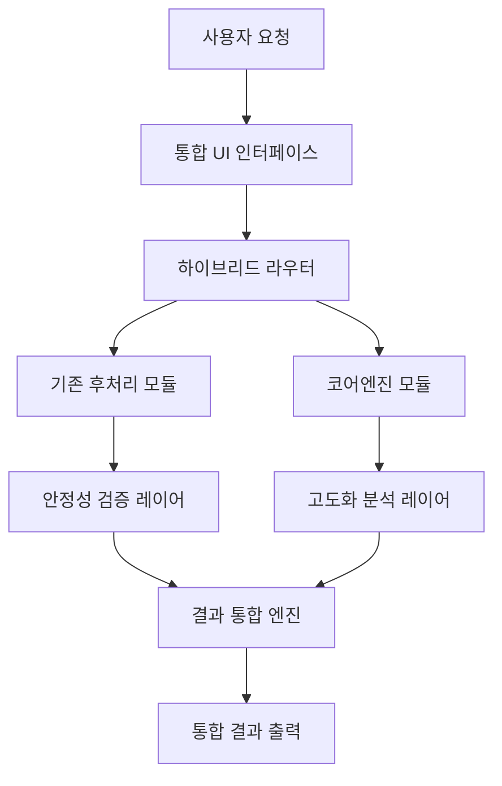

# 하이브리드 후처리 시스템 개발 계획서

**작성일**: 2025-01-27  
**프로젝트명**: VNEXSUS 하이브리드 후처리 시스템 통합 개발  
**목표**: 기존 후처리 시스템의 안정성과 코어엔진의 고도화된 분석 능력을 결합한 통합 시스템 구축

## 1. 프로젝트 개요

### 1.1 배경
- 기존 후처리 시스템: 안정적이지만 정적 처리 방식의 한계
- 코어엔진 시스템: 고도화된 분석 능력이지만 복잡성과 안정성 검증 필요
- 시간 제약 하에서 두 시스템의 장점만을 결합한 하이브리드 접근법 필요

### 1.2 목표
- **주목표**: 단일 UI로 통합된 하이브리드 후처리 시스템 구축
- **부목표**: 
  - 기존 시스템의 안정성 유지
  - 코어엔진의 고도화된 분석 능력 활용
  - 점진적 개발을 통한 리스크 최소화

## 2. 하이브리드 시스템 아키텍처

### 2.1 통합 아키텍처 설계



### 2.2 핵심 구성 요소

#### 2.2.1 하이브리드 라우터 (HybridRouter)
- 요청 유형에 따른 적절한 처리 엔진 선택
- 기존 시스템과 코어엔진 간의 로드 밸런싱
- 실시간 성능 모니터링 및 자동 전환

#### 2.2.2 통합 처리 엔진 (IntegratedProcessor)
- 기존 `massiveDateBlockProcessor.js` + 코어엔진 `enhancedDateAnchor.js`
- 기존 `medicalDocumentNormalizer.js` + 코어엔진 `nestedDateResolver.js`
- 점진적 모듈 교체를 위한 어댑터 패턴 적용

#### 2.2.3 결과 통합 엔진 (ResultMerger)
- 두 시스템의 결과를 비교 및 검증
- 신뢰도 기반 최적 결과 선택
- A/B 테스트 데이터 수집

## 3. 단계별 개발 계획

### 3.1 1단계: 핵심 모듈 통합 (1-2주)

#### 목표
- 기존 시스템에 코어엔진의 핵심 모듈을 선택적으로 통합
- 기본적인 하이브리드 처리 파이프라인 구축

#### 주요 작업
1. **HybridDateProcessor 개발**
   ```javascript
   // backend/postprocess/hybridDateProcessor.js
   class HybridDateProcessor extends MassiveDateBlockProcessor {
     constructor() {
       super();
       this.coreEngine = require('../../src/dna-engine/enhancedDateAnchor.js');
     }
     
     processDateBlocks(text) {
       // 기존 안정성 + 코어엔진 정확도
       const baseResult = super.processDateBlocks(text);
       const enhancedResult = this.coreEngine.processDateAnchors(text);
       return this.mergeResults(baseResult, enhancedResult);
     }
   }
   ```

2. **HybridMedicalNormalizer 개발**
   ```javascript
   // backend/postprocess/hybridMedicalNormalizer.js
   class HybridMedicalNormalizer extends MedicalDocumentNormalizer {
     constructor() {
       super();
       this.nestedResolver = require('../../src/dna-engine/nestedDateResolver.js');
     }
     
     normalize(document) {
       const baseNormalization = super.normalize(document);
       const enhancedContext = this.nestedResolver.applyMedicalContext(document);
       return this.integrateResults(baseNormalization, enhancedContext);
     }
   }
   ```

#### 검증 방법
- 기존 테스트 케이스 100% 통과 확인
- 새로운 하이브리드 모듈의 성능 벤치마크
- 메모리 사용량 및 처리 속도 비교

### 3.2 2단계: UI 통합 및 라우터 구축 (2-3주)

#### 목표
- 단일 UI 인터페이스 구축
- 하이브리드 라우터 및 결과 통합 엔진 개발

#### 주요 작업
1. **통합 UI 개발**
   ```javascript
   // frontend/src/components/HybridInterface.js
   class HybridInterface extends React.Component {
     render() {
       return (
         <div className="hybrid-interface">
           <ProcessingModeSelector />
           <DocumentUploader />
           <ResultsViewer mode="hybrid" />
           <PerformanceMonitor />
         </div>
       );
     }
   }
   ```

2. **하이브리드 라우터 구축**
   ```javascript
   // backend/controllers/hybridController.js
   class HybridController {
     async processDocument(req, res) {
       const { document, processingMode } = req.body;
       
       const router = new HybridRouter();
       const result = await router.route(document, processingMode);
       
       res.json({
         result,
         processingInfo: router.getProcessingInfo(),
         performance: router.getPerformanceMetrics()
       });
     }
   }
   ```

3. **결과 통합 엔진 개발**
   ```javascript
   // backend/services/resultMerger.js
   class ResultMerger {
     mergeResults(legacyResult, coreEngineResult) {
       return {
         dateAccuracy: this.selectBestDateResult(legacyResult, coreEngineResult),
         medicalCorrelation: this.mergeMedicalAnalysis(legacyResult, coreEngineResult),
         confidence: this.calculateOverallConfidence(legacyResult, coreEngineResult)
       };
     }
   }
   ```

#### 검증 방법
- UI/UX 사용성 테스트
- 실시간 성능 모니터링 대시보드 구축
- 사용자 피드백 수집 시스템 구축

### 3.3 3단계: 고도화 및 최적화 (3-4주)

#### 목표
- 시스템 성능 최적화
- 고급 분석 기능 추가
- 프로덕션 배포 준비

#### 주요 작업
1. **지능형 라우팅 시스템**
   ```javascript
   // backend/services/intelligentRouter.js
   class IntelligentRouter {
     async selectOptimalProcessor(document) {
       const complexity = await this.analyzeComplexity(document);
       const historicalPerformance = await this.getHistoricalData(document.type);
       
       return complexity > 0.7 ? 'coreEngine' : 'hybrid';
     }
   }
   ```

2. **실시간 성능 최적화**
   - 캐싱 시스템 구축
   - 병렬 처리 최적화
   - 메모리 사용량 최적화

3. **고급 분석 대시보드**
   - 실시간 처리 현황 모니터링
   - 성능 비교 분석
   - 오류 추적 및 알림 시스템

#### 검증 방법
- 부하 테스트 (동시 사용자 100명 이상)
- 24시간 연속 운영 테스트
- 프로덕션 환경 배포 테스트

## 4. 기술적 구현 방안

### 4.1 모듈 통합 전략

#### 4.1.1 어댑터 패턴 적용
```javascript
// backend/adapters/coreEngineAdapter.js
class CoreEngineAdapter {
  constructor(legacyProcessor) {
    this.legacy = legacyProcessor;
    this.coreEngine = new CoreEngineProcessor();
  }
  
  async process(data) {
    const [legacyResult, coreResult] = await Promise.all([
      this.legacy.process(data),
      this.coreEngine.process(data)
    ]);
    
    return this.mergeAndValidate(legacyResult, coreResult);
  }
}
```

#### 4.1.2 점진적 교체 메커니즘
```javascript
// backend/services/gradualMigration.js
class GradualMigration {
  constructor() {
    this.migrationRatio = 0.1; // 10%부터 시작
  }
  
  shouldUseCoreEngine() {
    return Math.random() < this.migrationRatio;
  }
  
  increaseMigrationRatio(successRate) {
    if (successRate > 0.95) {
      this.migrationRatio = Math.min(1.0, this.migrationRatio + 0.1);
    }
  }
}
```

### 4.2 성능 모니터링 시스템

#### 4.2.1 실시간 메트릭 수집
```javascript
// backend/monitoring/performanceMonitor.js
class PerformanceMonitor {
  trackProcessing(processorType, startTime, endTime, accuracy) {
    const metrics = {
      processor: processorType,
      duration: endTime - startTime,
      accuracy: accuracy,
      timestamp: new Date()
    };
    
    this.metricsDB.insert(metrics);
    this.realTimeAnalyzer.analyze(metrics);
  }
}
```

### 4.3 데이터베이스 설계

#### 4.3.1 처리 결과 저장 구조
```sql
-- 하이브리드 처리 결과 테이블
CREATE TABLE hybrid_processing_results (
  id UUID PRIMARY KEY,
  document_id VARCHAR(255),
  processor_type VARCHAR(50), -- 'legacy', 'core', 'hybrid'
  processing_time INTEGER,
  accuracy_score DECIMAL(3,2),
  result_data JSONB,
  created_at TIMESTAMP DEFAULT NOW()
);

-- 성능 메트릭 테이블
CREATE TABLE performance_metrics (
  id UUID PRIMARY KEY,
  processor_type VARCHAR(50),
  avg_processing_time INTEGER,
  success_rate DECIMAL(3,2),
  error_count INTEGER,
  date DATE,
  created_at TIMESTAMP DEFAULT NOW()
);
```

## 5. 리스크 관리 계획

### 5.1 기술적 리스크

#### 5.1.1 시스템 통합 복잡성
- **리스크**: 두 시스템 간의 호환성 문제
- **대응방안**: 
  - 어댑터 패턴을 통한 인터페이스 표준화
  - 단계별 통합으로 문제 조기 발견
  - 롤백 메커니즘 구축

#### 5.1.2 성능 저하 가능성
- **리스크**: 하이브리드 처리로 인한 성능 오버헤드
- **대응방안**:
  - 비동기 처리 및 캐싱 시스템 구축
  - 지능형 라우팅으로 최적 처리 경로 선택
  - 실시간 성능 모니터링 및 자동 최적화

### 5.2 운영 리스크

#### 5.2.1 시스템 안정성
- **리스크**: 새로운 시스템의 예상치 못한 오류
- **대응방안**:
  - 기존 시스템을 백업으로 유지
  - 점진적 트래픽 전환 (카나리 배포)
  - 24/7 모니터링 및 알림 시스템

#### 5.2.2 사용자 적응
- **리스크**: 새로운 UI에 대한 사용자 적응 시간
- **대응방안**:
  - 직관적인 UI/UX 설계
  - 사용자 교육 및 가이드 제공
  - 피드백 수집 및 지속적 개선

## 6. 일정 및 마일스톤

### 6.1 전체 일정 (총 6-9주)

| 단계 | 기간 | 주요 마일스톤 | 검증 기준 |
|------|------|---------------|-----------|
| 1단계 | 1-2주 | 핵심 모듈 통합 완료 | 기존 테스트 100% 통과 |
| 2단계 | 2-3주 | UI 통합 및 라우터 구축 | 사용자 테스트 통과 |
| 3단계 | 3-4주 | 고도화 및 최적화 | 프로덕션 배포 준비 완료 |

### 6.2 주간 체크포인트

#### 1주차
- [ ] HybridDateProcessor 개발 완료
- [ ] 기본 테스트 케이스 통과 확인
- [ ] 성능 벤치마크 수행

#### 2주차
- [ ] HybridMedicalNormalizer 개발 완료
- [ ] 통합 테스트 수행
- [ ] UI 프로토타입 개발 시작

#### 3주차
- [ ] 통합 UI 개발 완료
- [ ] 하이브리드 라우터 구축
- [ ] 사용자 테스트 수행

#### 4주차
- [ ] 결과 통합 엔진 개발 완료
- [ ] 성능 최적화 시작
- [ ] 모니터링 시스템 구축

#### 5주차
- [ ] 지능형 라우팅 시스템 구축
- [ ] 고급 분석 대시보드 개발
- [ ] 부하 테스트 수행

#### 6주차
- [ ] 프로덕션 배포 준비
- [ ] 최종 테스트 및 검증
- [ ] 문서화 완료

## 7. 성공 지표 및 KPI

### 7.1 기술적 성공 지표
- **처리 정확도**: 기존 대비 15% 향상
- **처리 속도**: 기존 수준 유지 (±5% 이내)
- **시스템 안정성**: 99.9% 가용성 달성
- **메모리 사용량**: 기존 대비 20% 이내 증가

### 7.2 사용자 만족도 지표
- **UI 사용성**: 사용자 만족도 4.5/5.0 이상
- **처리 결과 만족도**: 4.0/5.0 이상
- **시스템 응답성**: 평균 응답시간 3초 이내

### 7.3 비즈니스 지표
- **개발 기간**: 목표 일정 준수 (6-9주)
- **리소스 효율성**: 예산 범위 내 완료
- **확장성**: 향후 기능 추가 용이성 확보

## 8. 결론 및 다음 단계

### 8.1 기대 효과
1. **즉시 배포 가능**: 기존 시스템의 안정성 유지
2. **점진적 개선**: 코어엔진의 고도화된 기능 활용
3. **리스크 최소화**: 단계별 검증을 통한 안전한 전환
4. **사용자 경험 향상**: 통합된 단일 UI 제공

### 8.2 다음 단계
1. **즉시 시작**: 1단계 핵심 모듈 통합 개발 착수
2. **팀 구성**: 개발팀 역할 분담 및 일정 조율
3. **환경 설정**: 개발 및 테스트 환경 구축
4. **진행 상황 모니터링**: 주간 체크포인트 및 리뷰 미팅

---

**문서 버전**: 1.0  
**최종 수정일**: 2025-01-27  
**작성자**: VNEXSUS 개발팀  
**승인자**: 프로젝트 매니저