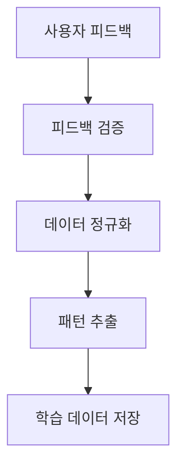
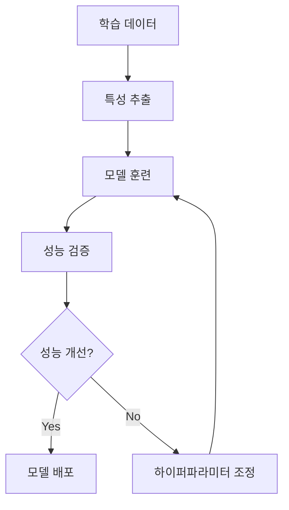
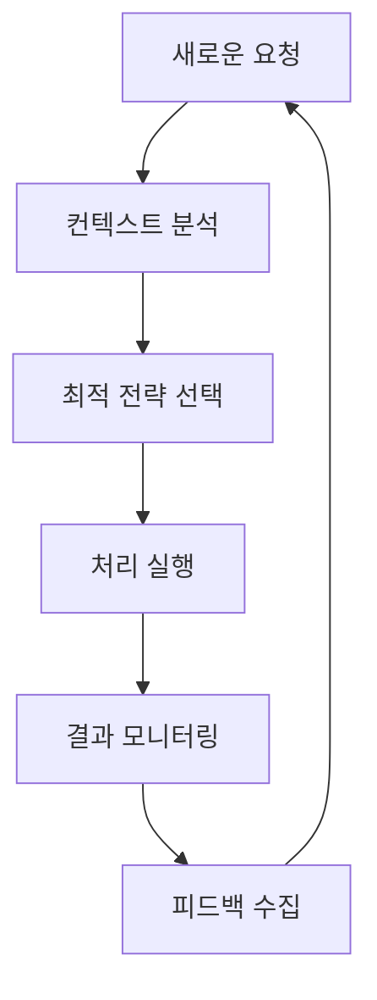

# Phase 3: 실시간 학습 시스템 설계 문서

## 📋 프로젝트 개요

### 목표
Phase 1 (기본 처리) + Phase 2 (AI 프롬프트 보강)에 이어, Phase 3에서는 실시간 학습 및 적응형 AI 시스템을 구축하여 사용자 피드백과 처리 결과를 바탕으로 지속적으로 성능을 개선하는 자가 학습 시스템을 개발합니다.

### 핵심 기능
1. **실시간 피드백 수집 시스템**
2. **적응형 프롬프트 최적화**
3. **성능 메트릭 기반 자동 조정**
4. **사용자 행동 패턴 분석**
5. **지속적 학습 파이프라인**

## 🏗️ 시스템 아키텍처

### 1. 실시간 피드백 수집 시스템
```
Frontend → Feedback API → Feedback Processor → Learning Engine
    ↓           ↓              ↓                    ↓
User Input → Validation → Pattern Analysis → Model Update
```

#### 주요 컴포넌트
- **FeedbackCollector**: 사용자 피드백 수집
- **FeedbackValidator**: 피드백 데이터 검증
- **FeedbackAnalyzer**: 피드백 패턴 분석
- **FeedbackStorage**: 피드백 데이터 저장

### 2. 적응형 프롬프트 최적화
```
Performance Metrics → Optimization Engine → Prompt Templates → AI Processing
        ↓                    ↓                   ↓              ↓
    Analysis Results → Strategy Selection → Template Update → Improved Output
```

#### 주요 컴포넌트
- **PerformanceMonitor**: 성능 지표 모니터링
- **OptimizationEngine**: 최적화 전략 엔진
- **PromptTemplateManager**: 프롬프트 템플릿 관리
- **AdaptiveProcessor**: 적응형 처리기

### 3. 지속적 학습 파이프라인
```
Data Collection → Feature Extraction → Model Training → Model Validation → Deployment
       ↓               ↓                   ↓              ↓              ↓
   Raw Feedback → Processed Features → Updated Model → Performance Test → Live Update
```

## 🔧 기술 스택

### Backend 확장
- **Node.js**: 기존 백엔드 확장
- **TensorFlow.js**: 클라이언트 사이드 ML
- **Redis**: 실시간 데이터 캐싱
- **MongoDB**: 학습 데이터 저장
- **WebSocket**: 실시간 통신

### 새로운 서비스
- **Learning Service**: 학습 로직 처리
- **Analytics Service**: 데이터 분석
- **Optimization Service**: 성능 최적화

### 모니터링 & 분석
- **Prometheus**: 메트릭 수집
- **Grafana**: 대시보드
- **ELK Stack**: 로그 분석

## 📊 데이터 모델

### 1. 피드백 데이터 구조
```javascript
{
  feedbackId: "uuid",
  sessionId: "uuid",
  userId: "string",
  timestamp: "datetime",
  documentType: "string",
  hospitalId: "string",
  feedback: {
    rating: "1-5",
    accuracy: "1-5",
    completeness: "1-5",
    usefulness: "1-5",
    comments: "string",
    corrections: [{
      field: "string",
      original: "string",
      corrected: "string",
      confidence: "number"
    }]
  },
  processingMetrics: {
    processingTime: "number",
    promptTokens: "number",
    responseTokens: "number",
    cacheHitRate: "number",
    errorCount: "number"
  },
  contextData: {
    documentLength: "number",
    detectedPatterns: ["string"],
    templateUsed: "string",
    enhancementApplied: "boolean"
  }
}
```

### 2. 학습 메트릭 구조
```javascript
{
  metricId: "uuid",
  timestamp: "datetime",
  period: "hourly|daily|weekly",
  metrics: {
    averageRating: "number",
    accuracyScore: "number",
    processingSpeed: "number",
    errorRate: "number",
    userSatisfaction: "number",
    templateEffectiveness: {
      [templateId]: {
        usage: "number",
        successRate: "number",
        averageRating: "number"
      }
    },
    promptPerformance: {
      [promptId]: {
        usage: "number",
        successRate: "number",
        averageImprovement: "number"
      }
    }
  }
}
```

## 🤖 학습 알고리즘

### 1. 피드백 기반 가중치 조정
```javascript
// 피드백 점수에 따른 가중치 계산
function calculateFeedbackWeight(feedback) {
  const weights = {
    rating: 0.3,
    accuracy: 0.4,
    completeness: 0.2,
    usefulness: 0.1
  };
  
  return Object.keys(weights).reduce((total, key) => {
    return total + (feedback[key] * weights[key]);
  }, 0) / 5; // 0-1 범위로 정규화
}
```

### 2. 적응형 프롬프트 선택
```javascript
// 성능 기반 프롬프트 선택 알고리즘
function selectOptimalPrompt(context, historicalPerformance) {
  const candidates = getPromptCandidates(context);
  
  return candidates.reduce((best, current) => {
    const currentScore = calculatePromptScore(current, historicalPerformance);
    const bestScore = calculatePromptScore(best, historicalPerformance);
    
    return currentScore > bestScore ? current : best;
  });
}
```

### 3. 템플릿 자동 업데이트
```javascript
// 성공률 기반 템플릿 업데이트
function updateTemplateBasedOnFeedback(templateId, feedbackData) {
  const successfulPatterns = extractSuccessfulPatterns(feedbackData);
  const failurePatterns = extractFailurePatterns(feedbackData);
  
  return {
    enhancedPatterns: successfulPatterns,
    deprecatedPatterns: failurePatterns,
    confidence: calculateConfidenceScore(feedbackData)
  };
}
```

## 🔄 실시간 학습 워크플로우

### 1. 피드백 수집 단계


### 2. 학습 실행 단계


### 3. 적용 단계


## 📈 성능 지표 및 KPI

### 1. 사용자 만족도 지표
- **평균 사용자 평점**: 목표 4.5/5.0 이상
- **정확도 점수**: 목표 95% 이상
- **완성도 점수**: 목표 90% 이상
- **유용성 점수**: 목표 4.0/5.0 이상

### 2. 시스템 성능 지표
- **평균 처리 시간**: 목표 30초 이하
- **오류율**: 목표 1% 이하
- **캐시 히트율**: 목표 80% 이상
- **시스템 가용성**: 목표 99.9% 이상

### 3. 학습 효과 지표
- **주간 성능 개선율**: 목표 2% 이상
- **피드백 반영률**: 목표 85% 이상
- **자동 최적화 성공률**: 목표 70% 이상

## 🛠️ 구현 계획

### Phase 3.1: 피드백 시스템 구축 (2주)
- [ ] 피드백 수집 API 개발
- [ ] 피드백 UI 컴포넌트 구현
- [ ] 데이터 검증 및 저장 로직
- [ ] 기본 분석 대시보드

### Phase 3.2: 학습 엔진 개발 (3주)
- [ ] 학습 알고리즘 구현
- [ ] 성능 메트릭 수집 시스템
- [ ] 자동 최적화 엔진
- [ ] A/B 테스트 프레임워크

### Phase 3.3: 실시간 적용 시스템 (2주)
- [ ] 실시간 모델 업데이트
- [ ] 적응형 프롬프트 선택
- [ ] 성능 모니터링 대시보드
- [ ] 알림 및 경고 시스템

### Phase 3.4: 통합 테스트 및 최적화 (1주)
- [ ] 전체 시스템 통합 테스트
- [ ] 성능 벤치마크
- [ ] 보안 검증
- [ ] 문서화 완료

## 🔒 보안 및 개인정보 보호

### 1. 데이터 보안
- 피드백 데이터 암호화
- 개인식별정보 마스킹
- 접근 권한 관리
- 감사 로그 기록

### 2. 학습 데이터 보호
- 데이터 익명화
- 차분 프라이버시 적용
- 연합 학습 고려
- 데이터 보존 정책

## 🚀 배포 전략

### 1. 단계적 배포
- **Alpha**: 내부 테스트 (10% 트래픽)
- **Beta**: 제한된 사용자 (30% 트래픽)
- **Production**: 전체 배포 (100% 트래픽)

### 2. 롤백 계획
- 자동 성능 모니터링
- 임계값 기반 자동 롤백
- 수동 롤백 프로세스
- 데이터 백업 및 복구

## 📋 위험 요소 및 대응 방안

### 1. 기술적 위험
- **과적합 문제**: 교차 검증 및 정규화
- **데이터 품질**: 자동 검증 및 필터링
- **성능 저하**: 점진적 학습 및 모니터링

### 2. 운영적 위험
- **사용자 저항**: 점진적 도입 및 교육
- **시스템 복잡성**: 모듈화 및 문서화
- **유지보수 부담**: 자동화 및 모니터링

## 📊 예상 효과

### 1. 성능 개선
- **정확도 향상**: 현재 대비 15% 개선 예상
- **처리 속도**: 현재 대비 25% 개선 예상
- **사용자 만족도**: 현재 대비 30% 개선 예상

### 2. 운영 효율성
- **수동 개입 감소**: 70% 감소 예상
- **오류 처리 시간**: 50% 단축 예상
- **시스템 안정성**: 99.9% 가용성 달성

## 🔄 지속적 개선 계획

### 1. 정기 검토
- **주간 성능 리뷰**: 매주 금요일
- **월간 전략 회의**: 매월 첫째 주
- **분기별 로드맵 업데이트**: 분기 시작

### 2. 기술 발전 대응
- **새로운 AI 모델 평가**: 분기별
- **기술 스택 업데이트**: 반기별
- **보안 패치 적용**: 즉시

---

**문서 버전**: 1.0
**작성일**: 2025-01-07
**다음 업데이트**: Phase 3.1 완료 후