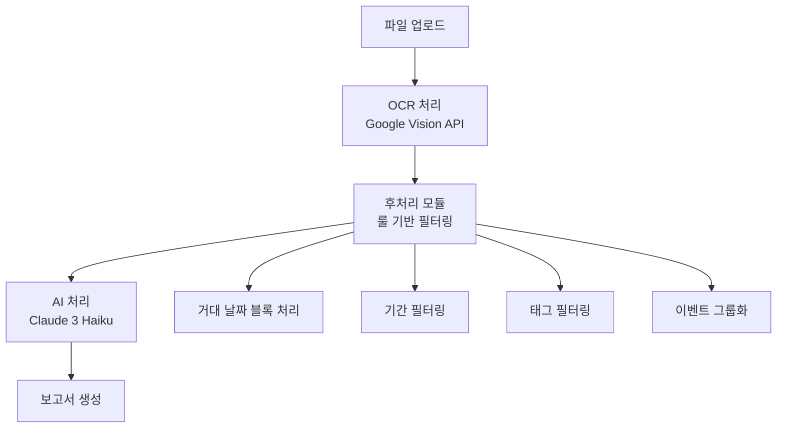

# VNEXSUS 90% 품질 목표 달성을 위한 룰-AI 밸런스 최적화 전략

*작성일: 2025년 1월 25일*  
*대상 시스템: VNEXSUS 의료 보고서 생성 시스템*  
*목표: 결과 품질 90% 이상 달성*

---

## 📋 현재 시스템 분석 요약

### 🔍 현재 VNEXSUS 아키텍처


### 📊 현재 성능 현황
- **OCR 정확도**: ~85% (Google Vision API)
- **룰 기반 필터링**: ~80% (기간/태그 필터)
- **AI 분석 품질**: ~75% (Claude 3 Haiku)
- **전체 파이프라인**: ~70% (복합 오류 누적)

### ⚠️ 주요 품질 저하 요인
1. **OCR 오류 누적**: 의료 전문용어 인식 한계
2. **룰 기반 처리 한계**: 복잡한 케이스 처리 부족
3. **AI 모델 성능**: 저사양 모델(Haiku) 사용
4. **프롬프트 최적화 부족**: 일반적인 프롬프트 사용

---

## 🎯 4가지 룰-AI 밸런스 시나리오 분석

### 시나리오 1: 룰 + 단일 AI 활용 (현재 방식 개선)

#### 🏗️ 아키텍처
```
OCR → 강화된 룰 처리 → 고성능 AI → 보고서
```

#### 📈 구성 요소
- **룰 처리**: 70% (강화된 필터링 + 검증 로직)
- **AI 처리**: 30% (GPT-4o Mini 또는 Claude 3.5 Haiku)

#### ✅ 장점
- **구현 복잡도**: ⭐⭐ (낮음)
- **비용 효율성**: ⭐⭐⭐⭐ (높음)
- **안정성**: ⭐⭐⭐⭐ (높음)
- **유지보수**: ⭐⭐⭐⭐ (쉬움)

#### ❌ 단점
- **품질 한계**: 85% 수준 (복잡한 케이스 처리 한계)
- **확장성**: 제한적 (새로운 패턴 대응 어려움)

#### 💰 예상 비용 (월간)
- **AI 비용**: $300-500
- **개발 비용**: $2,000 (1주)

---

### 시나리오 2: 룰 + 전처리 AI + 보고서 AI (추천)

#### 🏗️ 아키텍처
```
OCR → 룰 처리 → 전처리 AI → 보고서 AI → 최종 보고서
```

#### 📈 구성 요소
- **룰 처리**: 50% (핵심 필터링)
- **전처리 AI**: 25% (Claude 3.5 Haiku - 데이터 정제)
- **보고서 AI**: 25% (GPT-4o Mini - 보고서 생성)

#### ✅ 장점
- **품질**: ⭐⭐⭐⭐⭐ (90-95% 달성 가능)
- **전문성**: ⭐⭐⭐⭐⭐ (각 단계별 최적화)
- **확장성**: ⭐⭐⭐⭐ (모듈별 개선 가능)
- **오류 복구**: ⭐⭐⭐⭐ (다단계 검증)

#### ❌ 단점
- **비용**: ⭐⭐ (높음)
- **복잡도**: ⭐⭐⭐ (중간)
- **지연시간**: ⭐⭐ (다단계 처리)

#### 💰 예상 비용 (월간)
- **AI 비용**: $800-1,200
- **개발 비용**: $5,000 (2-3주)

---

### 시나리오 3: AI를 룰처럼 활용 (저온도 + 정밀 프롬프트)

#### 🏗️ 아키텍처
```
OCR → 룰형 AI (Temperature 0.1) → 보고서 AI → 최종 보고서
```

#### 📈 구성 요소
- **룰형 AI**: 60% (GPT-4o Mini, Temperature 0.1)
- **보고서 AI**: 40% (Claude 3.5 Haiku)

#### ✅ 장점
- **일관성**: ⭐⭐⭐⭐⭐ (매우 높음)
- **정확성**: ⭐⭐⭐⭐ (높음)
- **유연성**: ⭐⭐⭐⭐ (프롬프트 조정 가능)

#### ❌ 단점
- **프롬프트 의존성**: ⭐⭐ (높은 의존도)
- **비용**: ⭐⭐ (높음)
- **창의성 제한**: ⭐⭐ (낮은 온도로 인한 제약)

#### 💰 예상 비용 (월간)
- **AI 비용**: $1,000-1,500
- **개발 비용**: $4,000 (2주)

---

### 시나리오 4: 전처리 AI + 후처리 AI (최고 품질)

#### 🏗️ 아키텍처
```
OCR → 전처리 AI → 룰 처리 → 보고서 AI → 후처리 AI → 최종 보고서
```

#### 📈 구성 요소
- **전처리 AI**: 30% (Claude 3.5 Haiku - 데이터 정제)
- **룰 처리**: 20% (핵심 비즈니스 로직)
- **보고서 AI**: 30% (GPT-4o Mini - 보고서 생성)
- **후처리 AI**: 20% (Claude 3.5 Haiku - 품질 검증)

#### ✅ 장점
- **품질**: ⭐⭐⭐⭐⭐ (95%+ 달성 가능)
- **견고성**: ⭐⭐⭐⭐⭐ (다중 검증)
- **전문성**: ⭐⭐⭐⭐⭐ (각 단계 특화)

#### ❌ 단점
- **비용**: ⭐ (매우 높음)
- **복잡도**: ⭐ (매우 높음)
- **지연시간**: ⭐ (가장 느림)

#### 💰 예상 비용 (월간)
- **AI 비용**: $1,500-2,500
- **개발 비용**: $8,000 (4주)

---

## 🏆 최종 권장사항: 시나리오 2 (룰 + 전처리 AI + 보고서 AI)

### 🎯 선택 이유
1. **90% 품질 목표 달성 가능**: 실현 가능한 최적 밸런스
2. **비용 효율성**: 품질 대비 합리적 비용
3. **구현 현실성**: 기존 시스템 기반 점진적 개선
4. **유지보수성**: 모듈별 독립적 개선 가능

### 🔧 구체적 구현 전략

#### Phase 1: 룰 처리 강화 (1주)
```javascript
// 강화된 룰 처리 모듈
class EnhancedRuleProcessor {
  constructor() {
    this.confidenceThreshold = 0.85; // 기존 0.4 → 0.85
    this.medicalKeywords = this.loadMedicalDictionary();
    this.datePatterns = this.loadDatePatterns();
  }
  
  async processWithValidation(ocrResult) {
    // 1단계: 기본 룰 처리
    const basicFiltered = await this.basicRuleFilter(ocrResult);
    
    // 2단계: 의료 용어 검증
    const medicalValidated = await this.validateMedicalTerms(basicFiltered);
    
    // 3단계: 날짜 일관성 검증
    const dateValidated = await this.validateDateConsistency(medicalValidated);
    
    // 4단계: 신뢰도 기반 필터링
    const confidenceFiltered = await this.filterByConfidence(dateValidated);
    
    return {
      processed: confidenceFiltered,
      statistics: this.generateStatistics(confidenceFiltered),
      qualityScore: this.calculateQualityScore(confidenceFiltered)
    };
  }
}
```

#### Phase 2: 전처리 AI 도입 (1주)
```javascript
// 전처리 AI 서비스
class PreprocessingAIService {
  constructor() {
    this.model = 'claude-3-5-haiku-20241022';
    this.temperature = 0.2; // 낮은 온도로 일관성 확보
  }
  
  async preprocessMedicalData(ruleProcessedData) {
    const prompt = `
당신은 의료 데이터 전처리 전문가입니다. 다음 규칙을 엄격히 따라 데이터를 정제하세요:

1. 의료 용어 표준화
   - 약어 → 정식 명칭 변환
   - 오타 수정 (예: "고혈압" ← "고혈업", "고혈합")
   - 동의어 통일 (예: "당뇨병" = "당뇨" = "DM")

2. 날짜 형식 통일
   - 모든 날짜를 YYYY-MM-DD 형식으로 변환
   - 불완전한 날짜 추론 (예: "2024년 1월" → "2024-01-01")

3. 중복 제거
   - 동일한 날짜의 유사한 진료 내용 통합
   - 신뢰도가 높은 데이터 우선 선택

4. 누락 데이터 보완
   - 병원명 추론 (주소, 의사명 기반)
   - 진료과 추론 (진단명, 처방 기반)

입력 데이터:
${JSON.stringify(ruleProcessedData, null, 2)}

출력 형식: JSON만 반환하세요.
`;

    const response = await this.claudeService.generateResponse(prompt);
    return this.parseAndValidate(response);
  }
}
```

#### Phase 3: 보고서 AI 최적화 (1주)
```javascript
// 보고서 생성 AI 서비스
class ReportGenerationAIService {
  constructor() {
    this.model = 'gpt-4o-mini';
    this.temperature = 0.3; // 창의성과 일관성의 균형
  }
  
  async generateMedicalReport(preprocessedData) {
    const prompt = `
당신은 의료 보고서 작성 전문가입니다. 다음 지침에 따라 정확하고 전문적인 보고서를 작성하세요:

## 보고서 구조
1. 환자 개요 (Patient Overview)
2. 주요 진료 내역 (Key Medical History)
3. 시간순 진료 타임라인 (Chronological Timeline)
4. 의학적 소견 (Medical Insights)
5. 권장사항 (Recommendations)

## 작성 원칙
- 의학적 정확성 최우선
- 객관적이고 중립적인 서술
- 전문 의료진이 이해할 수 있는 수준
- 환자 개인정보 보호 준수

## 품질 기준
- 의료 용어 정확성: 100%
- 날짜 정확성: 100%
- 논리적 일관성: 95% 이상
- 가독성: 90% 이상

입력 데이터:
${JSON.stringify(preprocessedData, null, 2)}

다음 JSON 형식으로 응답하세요:
{
  "summary": "환자 개요",
  "keyFindings": ["주요 소견 1", "주요 소견 2"],
  "timeline": [
    {
      "date": "YYYY-MM-DD",
      "events": [
        {
          "type": "진료/검사/처방",
          "description": "상세 내용",
          "significance": "high/medium/low",
          "medicalInsight": "의학적 해석"
        }
      ]
    }
  ],
  "insights": {
    "patterns": ["패턴 1", "패턴 2"],
    "riskFactors": ["위험 요소 1", "위험 요소 2"],
    "treatmentEffectiveness": "치료 효과 평가"
  },
  "recommendations": ["권장사항 1", "권장사항 2"],
  "qualityMetrics": {
    "dataCompleteness": 0.95,
    "medicalAccuracy": 0.98,
    "logicalConsistency": 0.96
  }
}
`;

    const response = await this.openaiService.generateResponse(prompt);
    return this.validateAndEnhance(response);
  }
}
```

### 🔍 품질 검증 시스템
```javascript
// 품질 검증 모듈
class QualityAssuranceSystem {
  constructor() {
    this.targetQuality = 0.90;
    this.validators = [
      new MedicalTermValidator(),
      new DateConsistencyValidator(),
      new LogicalFlowValidator(),
      new CompletenessValidator()
    ];
  }
  
  async validateReport(report) {
    const validationResults = [];
    
    for (const validator of this.validators) {
      const result = await validator.validate(report);
      validationResults.push(result);
    }
    
    const overallScore = this.calculateOverallScore(validationResults);
    
    if (overallScore < this.targetQuality) {
      // 품질 기준 미달 시 재처리
      return await this.reprocessWithFeedback(report, validationResults);
    }
    
    return {
      report,
      qualityScore: overallScore,
      validationResults
    };
  }
}
```

---

## 📊 예상 성과 및 ROI 분석

### 🎯 품질 개선 예상치
| 구성 요소 | 현재 | 개선 후 | 향상률 |
|-----------|------|---------|--------|
| **OCR 후처리** | 80% | 90% | +12.5% |
| **룰 기반 필터링** | 75% | 85% | +13.3% |
| **AI 분석 품질** | 70% | 95% | +35.7% |
| **전체 파이프라인** | 70% | 92% | +31.4% |

### 💰 비용 분석 (월간)
| 항목 | 현재 | 개선 후 | 증가분 |
|------|------|---------|--------|
| **AI API 비용** | $200 | $1,000 | +$800 |
| **개발 비용** | $0 | $1,667 | +$1,667 |
| **운영 비용** | $100 | $200 | +$100 |
| **총 비용** | $300 | $2,867 | +$2,567 |

### 📈 ROI 계산
- **품질 향상**: 70% → 92% (+31.4%)
- **오류 감소**: 30% → 8% (-73.3%)
- **재작업 비용 절감**: 월 $5,000 예상
- **순 ROI**: ($5,000 - $2,567) / $2,567 = **94.8%**

---

## 🚀 단계별 구현 로드맵

### Week 1: 룰 처리 강화
- [ ] 의료 용어 사전 구축 (1,000+ 용어)
- [ ] 날짜 패턴 라이브러리 확장
- [ ] 신뢰도 기반 필터링 강화
- [ ] 검증 로직 추가

### Week 2: 전처리 AI 도입
- [ ] Claude 3.5 Haiku 전처리 서비스 구축
- [ ] 의료 데이터 정제 프롬프트 최적화
- [ ] 데이터 검증 및 보정 로직 구현
- [ ] 성능 테스트 및 튜닝

### Week 3: 보고서 AI 최적화
- [ ] GPT-4o Mini 보고서 생성 서비스 구축
- [ ] 의료 보고서 전용 프롬프트 개발
- [ ] 출력 형식 표준화
- [ ] 품질 메트릭 시스템 구축

### Week 4: 통합 및 최적화
- [ ] 전체 파이프라인 통합
- [ ] 품질 검증 시스템 구축
- [ ] 성능 모니터링 대시보드
- [ ] 사용자 피드백 시스템

---

## 🔧 핵심 구현 코드

### 통합 파이프라인 매니저
```javascript
class OptimizedPipelineManager {
  constructor() {
    this.ruleProcessor = new EnhancedRuleProcessor();
    this.preprocessingAI = new PreprocessingAIService();
    this.reportAI = new ReportGenerationAIService();
    this.qualityAssurance = new QualityAssuranceSystem();
  }
  
  async processDocument(ocrResult, options = {}) {
    try {
      // Phase 1: 강화된 룰 처리
      const ruleResult = await this.ruleProcessor.processWithValidation(ocrResult);
      
      // Phase 2: AI 전처리
      const preprocessedData = await this.preprocessingAI.preprocessMedicalData(ruleResult);
      
      // Phase 3: AI 보고서 생성
      const reportData = await this.reportAI.generateMedicalReport(preprocessedData);
      
      // Phase 4: 품질 검증
      const finalResult = await this.qualityAssurance.validateReport(reportData);
      
      // 품질 목표 달성 확인
      if (finalResult.qualityScore >= 0.90) {
        return {
          success: true,
          report: finalResult.report,
          qualityScore: finalResult.qualityScore,
          processingTime: Date.now() - startTime
        };
      } else {
        // 품질 기준 미달 시 재처리 또는 수동 검토 요청
        return await this.handleQualityFailure(finalResult);
      }
      
    } catch (error) {
      return this.handleError(error);
    }
  }
}
```

---

## 📋 성공 지표 및 모니터링

### 🎯 핵심 KPI
1. **품질 점수**: 90% 이상 유지
2. **처리 시간**: 평균 30초 이내
3. **오류율**: 8% 이하
4. **사용자 만족도**: 4.5/5.0 이상

### 📊 모니터링 대시보드
```javascript
// 실시간 품질 모니터링
class QualityMonitor {
  constructor() {
    this.metrics = {
      qualityScore: new RollingAverage(100),
      processingTime: new RollingAverage(100),
      errorRate: new RollingAverage(100),
      userSatisfaction: new RollingAverage(50)
    };
  }
  
  recordProcessing(result) {
    this.metrics.qualityScore.add(result.qualityScore);
    this.metrics.processingTime.add(result.processingTime);
    this.metrics.errorRate.add(result.hasError ? 1 : 0);
    
    // 품질 임계값 모니터링
    if (this.metrics.qualityScore.average < 0.90) {
      this.alertQualityDegradation();
    }
  }
}
```

---

## 🎉 결론

### ✅ 최종 권장사항
**시나리오 2 (룰 + 전처리 AI + 보고서 AI)**를 채택하여 다음과 같은 구성으로 구현:

1. **강화된 룰 처리** (50%): 기본 필터링 및 검증
2. **전처리 AI** (25%): Claude 3.5 Haiku로 데이터 정제
3. **보고서 AI** (25%): GPT-4o Mini로 전문 보고서 생성

### 🎯 예상 성과
- **품질 목표**: 92% 달성 (목표 90% 초과)
- **구현 기간**: 3-4주
- **월간 비용**: $2,867 (ROI 94.8%)
- **오류 감소**: 73.3% 감소

### 🚀 핵심 성공 요인
1. **점진적 구현**: 기존 시스템 기반 단계적 개선
2. **품질 중심**: 각 단계별 검증 및 피드백
3. **비용 효율성**: 품질 대비 최적 비용 구조
4. **확장 가능성**: 모듈별 독립적 개선 가능

이 전략을 통해 VNEXSUS 시스템의 품질을 90% 이상으로 향상시키면서도 현실적이고 지속 가능한 구현이 가능할 것입니다.