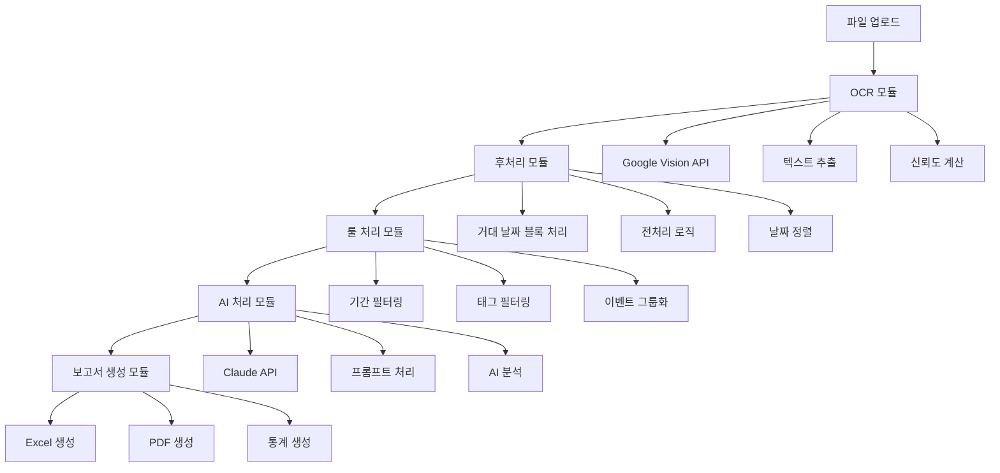

# VNEXSUS 모듈별 데이터 흐름 매핑 보고서

## 📋 개요

본 보고서는 VNEXSUS 시스템의 핵심 모듈인 OCR, 룰 처리, AI 처리 모듈의 역할과 데이터 흐름을 상세히 분석하고 매핑합니다.

---

## 🔄 전체 데이터 흐름 다이어그램



---

## 🔍 OCR 모듈 상세 분석

### 📍 모듈 위치 및 구성
```
backend/
├── controllers/ocrController.js     # OCR 컨트롤러
├── services/visionService.js        # Google Vision API 서비스
├── routes/ocrRoutes.js             # OCR 라우팅
└── utils/fileProcessor.js          # 파일 처리 유틸리티
```

### 🔧 핵심 기능 및 역할

#### 1. 파일 검증 및 전처리
```javascript
// backend/controllers/ocrController.js
const validateFiles = (files) => {
  const allowedMimeTypes = ['application/pdf', 'image/png', 'image/jpeg'];
  const maxFileSize = 100 * 1024 * 1024; // 100MB
  const maxFiles = 8;
  
  return files.filter(file => {
    return allowedMimeTypes.includes(file.mimetype) &&
           file.size > 0 &&
           file.size <= maxFileSize;
  });
};
```

#### 2. OCR 처리 파이프라인
```javascript
// backend/services/visionService.js
class VisionService {
  async processDocument(buffer, mimeType) {
    // 1단계: 이미지 전처리
    const processedImage = await this.preprocessImage(buffer);
    
    // 2단계: Google Vision API 호출
    const [result] = await this.client.textDetection({
      image: { content: processedImage },
      imageContext: {
        languageHints: ['ko', 'en']
      }
    });
    
    // 3단계: 텍스트 추출 및 정제
    const extractedText = this.extractText(result);
    
    // 4단계: 신뢰도 계산
    const confidence = this.calculateConfidence(result);
    
    return {
      text: extractedText,
      confidence: confidence,
      boundingBoxes: result.textAnnotations
    };
  }
}
```

### 📊 데이터 구조 변환

**입력 데이터**
```javascript
{
  files: [
    {
      fieldname: 'files',
      originalname: 'medical_report.pdf',
      mimetype: 'application/pdf',
      buffer: <Buffer>,
      size: 2048576
    }
  ]
}
```

**출력 데이터**
```javascript
{
  jobId: "550e8400-e29b-41d4-a716-446655440000",
  status: "completed",
  results: {
    "medical_report.pdf": {
      text: "환자명: 홍길동\n진료일: 2024-01-15\n진단명: 고혈압...",
      confidence: 0.95,
      boundingBoxes: [...],
      metadata: {
        pageCount: 3,
        processingTime: 2.5
      }
    }
  },
  statistics: {
    totalFiles: 1,
    successfulFiles: 1,
    averageConfidence: 0.95,
    totalProcessingTime: 2.5
  }
}
```

---

## ⚙️ 룰 처리 모듈 상세 분석

### 📍 모듈 위치 및 구성
```
src/
├── lib/
│   ├── periodFilter.ts              # 기간 필터링
│   └── eventGrouper.ts             # 이벤트 그룹화
├── modules/
│   └── tagFilter.ts                # 태그 기반 필터링
└── config/
    └── tagRules.json               # 룰 설정 파일
```

### 🔧 핵심 기능 및 역할

#### 1. 기간 필터링 (periodFilter.ts)
```typescript
interface FilterOptions {
  startDate?: string;
  endDate?: string;
  minConfidence?: number;
  includeTags?: string[];
  excludeTags?: string[];
  includeBeforeEnrollment?: boolean;
}

export class PeriodFilter {
  filter(events: Event[], options: FilterOptions): FilterResult {
    // 1단계: 날짜 범위 필터링
    let filtered = this.filterByDateRange(events, options);
    
    // 2단계: 신뢰도 필터링
    filtered = this.filterByConfidence(filtered, options.minConfidence || 0.6);
    
    // 3단계: 태그 필터링
    filtered = this.filterByTags(filtered, options);
    
    // 4단계: 보험 가입일 기준 필터링
    const { beforeEnrollment, afterEnrollment } = 
      this.splitByEnrollmentDate(filtered, options);
    
    return {
      filtered: afterEnrollment,
      beforeEnrollment: beforeEnrollment,
      statistics: this.generateStatistics(events, filtered)
    };
  }
}
```

#### 2. 태그 기반 필터링 (tagFilter.ts)
```typescript
import rules from '../config/tagRules.json';

export class TagFilter {
  isExcluded(event: Event): boolean {
    const text = event.rawText.toLowerCase();
    
    // 제외 룰 적용
    for (const category in rules.exclude) {
      const keywords = rules.exclude[category];
      if (keywords.some(keyword => text.includes(keyword))) {
        return true;
      }
    }
    
    return false;
  }
  
  calculateImportance(event: Event): number {
    const text = event.rawText.toLowerCase();
    let importance = 1.0;
    
    // 중요도 가중치 적용
    for (const category in rules.important) {
      const keywords = rules.important[category];
      const matches = keywords.filter(keyword => text.includes(keyword));
      importance += matches.length * 0.2;
    }
    
    return Math.min(importance, 2.0);
  }
}
```

#### 3. 이벤트 그룹화 (eventGrouper.ts)
```typescript
export class EventGrouper {
  async createTimeline(events: Event[], options: GroupingOptions): Promise<Timeline> {
    // 1단계: 날짜별 그룹화
    const dateGroups = this.groupByDate(events);
    
    // 2단계: 병원별 그룹화
    const hospitalGroups = this.groupByHospital(dateGroups, options);
    
    // 3단계: 중복 이벤트 병합
    const mergedEvents = this.mergeDuplicateEvents(hospitalGroups);
    
    // 4단계: 타임라인 생성
    const timeline = this.generateTimeline(mergedEvents);
    
    return {
      events: timeline,
      startDate: this.getEarliestDate(events),
      endDate: this.getLatestDate(events),
      hospitals: this.extractHospitals(events),
      tags: this.extractTags(events)
    };
  }
}
```

### 📊 데이터 구조 변환

**입력 데이터 (OCR 결과)**
```javascript
{
  dateBlocks: [
    {
      date: "2024-01-15",
      text: "환자명: 홍길동 진료과: 내과 진단명: 고혈압",
      confidence: 0.95,
      rawText: "2024-01-15 환자명: 홍길동..."
    }
  ]
}
```

**출력 데이터 (룰 처리 결과)**
```javascript
{
  filtered: [
    {
      id: "evt_001",
      date: "2024-01-15",
      eventType: "진료",
      description: "내과 진료 - 고혈압 진단",
      hospital: "명지병원",
      confidence: 0.95,
      importance: 1.4,
      tags: ["진단", "내과", "고혈압"],
      beforeEnrollment: false
    }
  ],
  beforeEnrollment: [...],
  statistics: {
    total: 150,
    filtered: 120,
    excluded: 30,
    averageConfidence: 0.85,
    filteringRate: 20.0
  }
}
```

---

## 🤖 AI 처리 모듈 상세 분석

### 📍 모듈 위치 및 구성
```
src/
├── services/
│   └── claudeService.js            # Claude API 서비스
backend/
├── modules/ai/
│   ├── promptTemplates.js          # 프롬프트 템플릿
│   └── promptTemplates/
│       ├── timeline_generation.txt
│       ├── medical_text_analysis.txt
│       └── report_summary.txt
└── ai-report-generator/
    └── index.js                    # AI 보고서 생성기
```

### 🔧 핵심 기능 및 역할

#### 1. 프롬프트 템플릿 관리
```javascript
// backend/modules/ai/promptTemplates.js
const defaultTemplates = {
  'timeline_generation.txt': `
    당신은 의료 기록에서 타임라인을 생성하는 AI 비서입니다.
    
    규칙:
    1. 각 이벤트는 날짜, 이벤트 유형, 설명을 포함해야 합니다
    2. 날짜 형식은 YYYY-MM-DD로 통일합니다
    3. 중복된 이벤트는 제거하되, 정보가 추가된 경우 병합합니다
    4. 의료 약어는 가능한 전체 용어로 확장합니다
    5. 불확실한 정보는 신뢰도와 함께 표시합니다
    
    입력 데이터: {events}
    
    출력 형식: JSON
  `,
  
  'medical_text_analysis.txt': `
    의료 텍스트를 분석하여 구조화된 정보를 추출합니다.
    
    추출할 정보:
    - 환자 정보 (이름, 나이, 성별)
    - 진료 정보 (날짜, 병원, 진료과)
    - 진단 정보 (진단명, ICD 코드)
    - 치료 정보 (처방, 시술, 수술)
    - 검사 정보 (검사명, 결과, 수치)
    
    텍스트: {text}
  `
};
```

#### 2. Claude API 서비스
```javascript
// src/services/claudeService.js
class ClaudeService {
  constructor() {
    this.apiKey = process.env.CLAUDE_API_KEY;
    this.model = 'claude-3-haiku-20240307';
    this.maxTokens = 8192;
    this.temperature = 0.3;
  }
  
  async generateMedicalReport(events, options = {}) {
    // 1단계: 프롬프트 준비
    const prompt = await this.preparePrompt(events, options);
    
    // 2단계: Claude API 호출
    const response = await this.callClaudeApi(prompt);
    
    // 3단계: 응답 파싱 및 검증
    const parsedResponse = this.parseResponse(response);
    
    // 4단계: 후처리 및 포맷팅
    const formattedReport = this.formatReport(parsedResponse);
    
    return formattedReport;
  }
  
  async callClaudeApi(prompt) {
    const response = await fetch('https://api.anthropic.com/v1/messages', {
      method: 'POST',
      headers: {
        'Content-Type': 'application/json',
        'x-api-key': this.apiKey,
        'anthropic-version': '2023-06-01'
      },
      body: JSON.stringify({
        model: this.model,
        max_tokens: this.maxTokens,
        temperature: this.temperature,
        messages: [{
          role: 'user',
          content: prompt
        }]
      })
    });
    
    return response.json();
  }
}
```

#### 3. AI 보고서 생성기
```javascript
// backend/ai-report-generator/index.js
class AIReportGenerator {
  async generateReport(timeline, options = {}) {
    // 1단계: 데이터 전처리
    const preprocessedData = this.preprocessTimeline(timeline);
    
    // 2단계: 프롬프트 구성
    const prompt = this.buildPrompt(preprocessedData, options);
    
    // 3단계: AI 분석 실행
    const analysis = await this.claudeService.generateMedicalReport(
      preprocessedData, 
      { prompt, ...options }
    );
    
    // 4단계: 보고서 구조화
    const structuredReport = this.structureReport(analysis);
    
    return {
      summary: structuredReport.summary,
      timeline: structuredReport.timeline,
      insights: structuredReport.insights,
      recommendations: structuredReport.recommendations,
      metadata: {
        generatedAt: new Date().toISOString(),
        model: 'claude-3-haiku-20240307',
        confidence: structuredReport.confidence
      }
    };
  }
}
```

### 📊 데이터 구조 변환

**입력 데이터 (룰 처리 결과)**
```javascript
{
  events: [
    {
      id: "evt_001",
      date: "2024-01-15",
      eventType: "진료",
      description: "내과 진료 - 고혈압 진단",
      hospital: "명지병원",
      confidence: 0.95,
      tags: ["진단", "내과", "고혈압"]
    }
  ],
  startDate: "2024-01-01",
  endDate: "2024-12-31",
  hospitals: ["명지병원", "서울대병원"],
  tags: ["진단", "치료", "검사"]
}
```

**출력 데이터 (AI 처리 결과)**
```javascript
{
  summary: {
    patientOverview: "환자는 2024년 1월부터 고혈압 관리를 위한 지속적인 치료를 받고 있습니다.",
    keyFindings: [
      "고혈압 진단 및 지속적 관리",
      "정기적인 혈압 모니터링",
      "약물 치료 순응도 양호"
    ],
    treatmentPeriod: "2024-01-15 ~ 2024-12-31",
    totalVisits: 12
  },
  timeline: [
    {
      date: "2024-01-15",
      events: [
        {
          type: "진단",
          description: "고혈압 초기 진단",
          significance: "high",
          aiInsight: "환자의 혈압이 140/90 mmHg를 초과하여 고혈압으로 진단되었습니다."
        }
      ]
    }
  ],
  insights: {
    medicalPatterns: [
      "정기적인 내과 진료 패턴 확인",
      "혈압 관리를 위한 지속적 모니터링"
    ],
    riskFactors: [
      "고혈압으로 인한 심혈관 질환 위험"
    ],
    treatmentEffectiveness: "양호"
  },
  recommendations: [
    "지속적인 혈압 모니터링 필요",
    "생활습관 개선 권장",
    "정기적인 심혈관 검사 필요"
  ],
  metadata: {
    generatedAt: "2024-01-20T10:30:00Z",
    model: "claude-3-haiku-20240307",
    confidence: 0.92,
    processingTime: 8.5
  }
}
```

---

## 🔗 모듈 간 인터페이스

### 1. OCR → 룰 처리 인터페이스
```javascript
// 데이터 전달 형식
interface OCRToRuleInterface {
  dateBlocks: DateBlock[];
  structuredGroups: StructuredGroup[];
  statistics: OCRStatistics;
}

// 호출 방식
const ruleProcessor = new RuleProcessor();
const ruleResult = await ruleProcessor.process(ocrResult);
```

### 2. 룰 처리 → AI 처리 인터페이스
```javascript
// 데이터 전달 형식
interface RuleToAIInterface {
  filtered: Event[];
  beforeEnrollment: Event[];
  statistics: RuleStatistics;
  metadata: ProcessingMetadata;
}

// 호출 방식
const aiProcessor = new AIProcessor();
const aiResult = await aiProcessor.analyze(ruleResult);
```

### 3. AI 처리 → 보고서 생성 인터페이스
```javascript
// 데이터 전달 형식
interface AIToReportInterface {
  summary: ReportSummary;
  timeline: AITimeline;
  insights: AIInsights;
  recommendations: string[];
  metadata: AIMetadata;
}

// 호출 방식
const reportGenerator = new ReportGenerator();
const finalReport = await reportGenerator.create(aiResult);
```

---

## 📈 성능 최적화 포인트

### 1. OCR 모듈 최적화
- **병렬 처리**: 다중 파일 동시 OCR 처리
- **캐싱**: 동일 파일 재처리 방지
- **압축**: 이미지 전처리를 통한 API 호출 최적화

### 2. 룰 처리 모듈 최적화
- **인덱싱**: 태그 및 키워드 인덱스 구축
- **배치 처리**: 대량 이벤트 일괄 처리
- **메모리 관리**: 스트리밍 방식 데이터 처리

### 3. AI 처리 모듈 최적화
- **프롬프트 최적화**: 토큰 사용량 최소화
- **응답 캐싱**: 유사한 요청 결과 재사용
- **비동기 처리**: 논블로킹 AI API 호출

---

## 🔍 에러 처리 및 복구 전략

### 1. OCR 모듈 에러 처리
```javascript
try {
  const ocrResult = await visionService.processDocument(buffer);
} catch (error) {
  if (error.code === 'QUOTA_EXCEEDED') {
    // 할당량 초과 시 대기 후 재시도
    await this.waitAndRetry(processDocument, buffer);
  } else if (error.code === 'INVALID_IMAGE') {
    // 이미지 전처리 후 재시도
    const processedBuffer = await this.preprocessImage(buffer);
    return await this.processDocument(processedBuffer);
  }
}
```

### 2. 룰 처리 모듈 에러 처리
```javascript
try {
  const filtered = await periodFilter.filter(events, options);
} catch (error) {
  // 부분 실패 시 기본 룰로 폴백
  const fallbackOptions = { ...options, minConfidence: 0.5 };
  return await this.fallbackFilter(events, fallbackOptions);
}
```

### 3. AI 처리 모듈 에러 처리
```javascript
try {
  const aiResult = await claudeService.generateReport(timeline);
} catch (error) {
  if (error.code === 'RATE_LIMIT') {
    // 속도 제한 시 큐에 추가
    await this.addToQueue(generateReport, timeline);
  } else {
    // AI 실패 시 룰 기반 보고서 생성
    return await this.generateRuleBasedReport(timeline);
  }
}
```

---

이 모듈별 데이터 흐름 매핑을 통해 각 모듈의 역할과 상호작용을 명확히 파악할 수 있으며, 다음 단계에서는 이를 바탕으로 개선 전략을 수립하겠습니다.