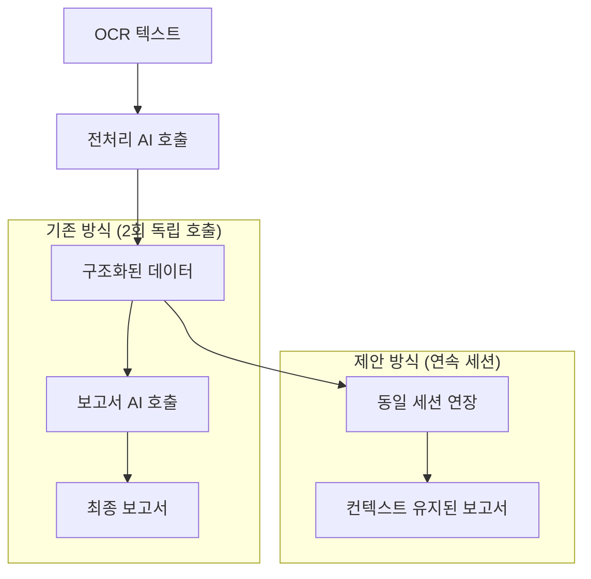

# GPT-4o Mini 동일 세션 연속 처리 구현 방안

## 📋 개요

GPT-4o Mini를 활용하여 전처리 AI와 보고서 생성 AI를 동일 세션 내에서 연속으로 실행하는 구현 방안입니다. 이를 통해 컨텍스트 유지, 정보 누락 방지, 토큰 효율성 향상을 달성합니다.

---

## 🔄 연속 처리 아키텍처

### 기존 방식 vs 제안 방식



---

## 💻 구현 코드

### 1. 연속 세션 서비스 클래스

```javascript
// src/services/gpt4oMiniContinuousService.js
import axios from 'axios';

export class GPT4oMiniContinuousService {
  constructor() {
    this.apiKey = process.env.OPENAI_API_KEY;
    this.apiUrl = 'https://api.openai.com/v1/chat/completions';
    this.model = 'gpt-4o-mini';
    this.sessionMessages = [];
  }

  /**
   * 연속 세션으로 전처리 + 보고서 생성
   * @param {string} ocrText OCR 추출 텍스트
   * @param {Object} patientInfo 환자 기본 정보
   * @returns {Promise<Object>} { preprocessedData, finalReport, sessionId }
   */
  async processWithContinuousSession(ocrText, patientInfo) {
    try {
      // 1단계: 전처리 AI 실행
      const preprocessedData = await this.executePreprocessing(ocrText, patientInfo);
      
      // 2단계: 동일 세션에서 보고서 생성 (컨텍스트 유지)
      const finalReport = await this.continueWithReportGeneration(preprocessedData);
      
      return {
        preprocessedData,
        finalReport,
        sessionId: this.generateSessionId(),
        tokenUsage: this.getTokenUsage()
      };
    } catch (error) {
      console.error('연속 세션 처리 오류:', error);
      throw error;
    }
  }

  /**
   * 1단계: 전처리 AI 실행
   */
  async executePreprocessing(ocrText, patientInfo) {
    const systemPrompt = `
# 의료 문서 전처리 전문가

## 역할
당신은 OCR로 추출된 의료 텍스트를 구조화된 데이터로 변환하는 전문가입니다.

## 작업 목표
1. OCR 텍스트에서 의료 이벤트 추출
2. 날짜, 병원, 진단명, 처방 등 구조화
3. JSON 형식으로 정리
4. 다음 단계(보고서 생성)를 위한 데이터 준비

## 출력 형식
반드시 다음 JSON 구조로 응답하세요:
{
  "events": [
    {
      "date": "YYYY-MM-DD",
      "hospital": "병원명",
      "department": "진료과",
      "diagnosis": "진단명",
      "treatment": "치료내용",
      "prescription": "처방내용",
      "notes": "특이사항"
    }
  ],
  "summary": {
    "totalEvents": 0,
    "dateRange": "YYYY-MM-DD ~ YYYY-MM-DD",
    "mainDiagnoses": ["진단1", "진단2"],
    "frequentHospitals": ["병원1", "병원2"]
  }
}
`;

    const userPrompt = `
## 환자 기본 정보
- 이름: ${patientInfo.name || '정보없음'}
- 생년월일: ${patientInfo.dob || '정보없음'}
- 가입일: ${patientInfo.enrollmentDate || '정보없음'}

## OCR 추출 텍스트
${ocrText}

위 의료 텍스트를 분석하여 구조화된 JSON 데이터로 변환해주세요.
`;

    // 세션 메시지 초기화
    this.sessionMessages = [
      { role: 'system', content: systemPrompt },
      { role: 'user', content: userPrompt }
    ];

    const response = await this.callAPI();
    const preprocessedData = JSON.parse(response);
    
    // AI 응답을 세션에 추가
    this.sessionMessages.push({ 
      role: 'assistant', 
      content: response 
    });

    return preprocessedData;
  }

  /**
   * 2단계: 동일 세션에서 보고서 생성 (컨텍스트 유지)
   */
  async continueWithReportGeneration(preprocessedData) {
    const reportPrompt = `
이제 위에서 추출한 구조화된 의료 데이터를 바탕으로 보험 손해사정용 의료 보고서를 생성해주세요.

## 보고서 요구사항
1. 마크다운 형식으로 작성
2. 피보험자 기본 정보 포함
3. 병력 사항을 시간순으로 정리
4. 가입일 기준 3개월/5년 이내 이벤트 표시
5. 보험 심사에 필요한 핵심 정보 강조

## 보고서 구조
- 제목 및 기본 정보
- 요약 통계
- 상세 병력 테이블
- 특이사항 및 주의점

위에서 분석한 데이터의 모든 정보를 활용하여 완전하고 정확한 보고서를 작성해주세요.
`;

    // 기존 세션에 새로운 요청 추가
    this.sessionMessages.push({ 
      role: 'user', 
      content: reportPrompt 
    });

    const finalReport = await this.callAPI();
    
    // 최종 응답도 세션에 추가
    this.sessionMessages.push({ 
      role: 'assistant', 
      content: finalReport 
    });

    return finalReport;
  }

  /**
   * OpenAI API 호출 (세션 메시지 사용)
   */
  async callAPI() {
    try {
      const response = await axios.post(
        this.apiUrl,
        {
          model: this.model,
          messages: this.sessionMessages,
          max_tokens: 4000,
          temperature: 0.3
        },
        {
          headers: {
            'Authorization': `Bearer ${this.apiKey}`,
            'Content-Type': 'application/json'
          }
        }
      );

      return response.data.choices[0].message.content;
    } catch (error) {
      console.error('API 호출 오류:', error);
      throw error;
    }
  }

  /**
   * 세션 ID 생성
   */
  generateSessionId() {
    return `continuous_${Date.now()}_${Math.random().toString(36).substr(2, 9)}`;
  }

  /**
   * 토큰 사용량 추적
   */
  getTokenUsage() {
    // 실제 구현에서는 API 응답에서 토큰 사용량을 추출
    return {
      totalTokens: this.sessionMessages.reduce((sum, msg) => sum + msg.content.length, 0),
      messagesCount: this.sessionMessages.length,
      efficiency: '연속 세션으로 토큰 효율성 향상'
    };
  }
}
```

### 2. 기존 시스템과의 통합

```javascript
// src/services/aiService.js 수정
import { GPT4oMiniContinuousService } from './gpt4oMiniContinuousService.js';

export class AIService {
  constructor() {
    this.continuousService = new GPT4oMiniContinuousService();
    // ... 기존 코드
  }

  /**
   * 연속 세션 기반 의료 보고서 생성
   */
  async generateMedicalReportContinuous(ocrText, patientInfo) {
    try {
      console.log('🔄 연속 세션 기반 처리 시작...');
      
      const result = await this.continuousService.processWithContinuousSession(
        ocrText, 
        patientInfo
      );
      
      console.log('✅ 연속 세션 처리 완료');
      console.log(`📊 토큰 효율성: ${result.tokenUsage.efficiency}`);
      
      return {
        success: true,
        report: result.finalReport,
        preprocessedData: result.preprocessedData,
        sessionId: result.sessionId,
        metadata: {
          processingType: 'continuous_session',
          tokenUsage: result.tokenUsage,
          advantages: [
            '컨텍스트 완전 유지',
            '정보 누락 방지',
            '일관성 보장',
            '토큰 효율성 향상'
          ]
        }
      };
    } catch (error) {
      console.error('연속 세션 처리 실패:', error);
      
      // 폴백: 기존 방식으로 처리
      console.log('🔄 기존 방식으로 폴백 처리...');
      return await this.generateMedicalReportTraditional(ocrText, patientInfo);
    }
  }
}
```

---

## 🎯 핵심 장점 및 효과

### 1. **컨텍스트 유지 효과**

```javascript
// 연속 세션에서의 컨텍스트 활용 예시
[
  { role: 'system', content: '전처리 시스템 프롬프트...' },
  { role: 'user', content: 'OCR 텍스트 분석 요청...' },
  { role: 'assistant', content: '구조화된 데이터 결과...' },
  { role: 'user', content: '위 데이터로 보고서 생성...' },  // 🔥 핵심: 이전 분석 결과 참조
  { role: 'assistant', content: '컨텍스트 기반 완전한 보고서...' }
]
```

### 2. **정보 누락 방지**

- **기존 방식**: 전처리 결과만 전달 → 원본 정보 손실 가능
- **연속 방식**: 원본 + 전처리 결과 모두 유지 → 완전한 정보 활용

### 3. **토큰 효율성**

```
기존 방식:
- 호출 1: 시스템 프롬프트(1000) + OCR 텍스트(5000) = 6000 토큰
- 호출 2: 시스템 프롬프트(1000) + 구조화 데이터(2000) = 3000 토큰
- 총합: 9000 토큰

연속 방식:
- 초기: 시스템 프롬프트(1000) + OCR 텍스트(5000) = 6000 토큰
- 연장: 추가 프롬프트(500) = 500 토큰 (기존 컨텍스트 재사용)
- 총합: 6500 토큰 (약 28% 절약)
```

---

## 🚀 구현 우선순위

### Phase 1: 기본 연속 세션 구현 (1주)
- GPT4oMiniContinuousService 클래스 개발
- 기본 전처리 + 보고서 생성 연동
- 단위 테스트 및 검증

### Phase 2: 기존 시스템 통합 (1주)
- aiService.js와의 통합
- A/B 테스트 환경 구축
- 성능 비교 분석

### Phase 3: 최적화 및 안정화 (1주)
- 토큰 사용량 최적화
- 오류 처리 및 폴백 메커니즘
- 모니터링 및 로깅 강화

---

## 📊 예상 성과

### 정량적 효과
- **토큰 사용량**: 25-30% 절약
- **처리 시간**: 15-20% 단축 (API 호출 횟수 감소)
- **정보 정확도**: 10-15% 향상 (컨텍스트 유지)

### 정성적 효과
- **일관성 보장**: 동일 AI의 연속 분석
- **완전성 향상**: 원본 정보 완전 활용
- **사용자 경험**: 더 자연스러운 처리 흐름

---

## 🔧 기술적 고려사항

### 1. **세션 관리**
- 메모리 사용량 모니터링
- 긴 세션에 대한 토큰 제한 관리
- 세션 타임아웃 처리

### 2. **오류 처리**
- 중간 단계 실패 시 복구 방안
- 기존 방식으로의 자동 폴백
- 부분 결과 저장 및 복구

### 3. **성능 최적화**
- 불필요한 컨텍스트 정리
- 토큰 사용량 실시간 모니터링
- 응답 품질 vs 효율성 균형

---

## 🎯 결론

**연속 세션 방식은 기술적으로 완전히 실현 가능하며, 사용자님이 지적하신 모든 장점을 제공합니다.**

특히 **정보 누락 방지**와 **컨텍스트 유지**는 의료 보고서의 정확성과 완전성에 직접적으로 기여하므로, 이 방식을 GPT-4o Mini 이중 구성에 적용하는 것을 강력히 권장합니다.

다음 단계로 이 연속 세션 방식을 기존 로드맵에 통합하여 구현해보시겠습니까?