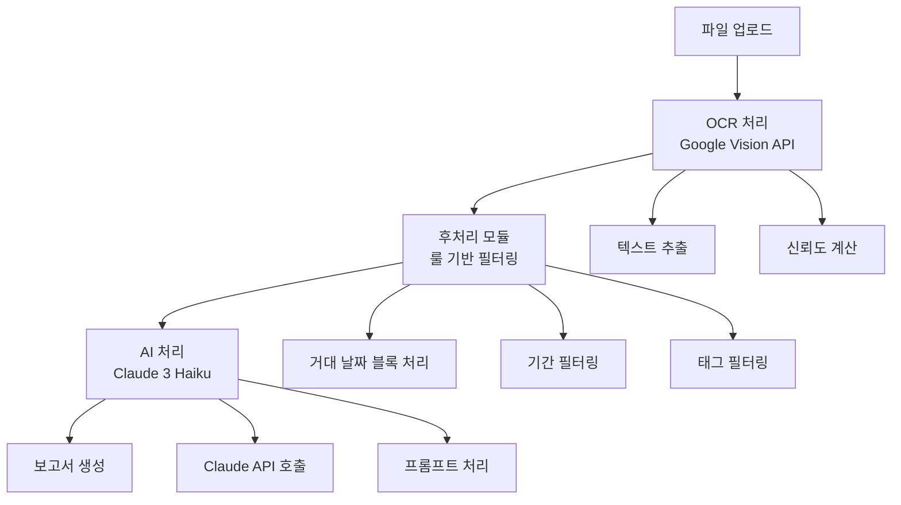

# GPT-4o Mini 이중 구성 구현 계획서

*작성일: 2025년 1월 25일*  
*대상 시스템: VNEXSUS 의료 보고서 생성 시스템*  
*목표: 전처리 AI + 보고서 AI 모두 GPT-4o Mini로 통합*

---

## 📋 목차

1. [현재 시스템 분석](#1-현재-시스템-분석)
2. [모듈 간 의존성 분석](#2-모듈-간-의존성-분석)
3. [호환성 유지 계획](#3-호환성-유지-계획)
4. [단계별 개발 로드맵](#4-단계별-개발-로드맵)
5. [주요 기능 점검 체크리스트](#5-주요-기능-점검-체크리스트)
6. [구현 가이드](#6-구현-가이드)

---

## 1. 현재 시스템 분석

### 1.1 🏗️ 기존 파이프라인 아키텍처



### 1.2 📁 핵심 모듈 구성

#### **AI 서비스 모듈**
- **통합 AI 서비스**: `backend/modules/ai/aiService.js`
  - 다중 AI 제공자 지원 (OpenAI, Anthropic, Azure, Cohere)
  - 기본 제공자: `anthropic` (Claude)
  - 기본 모델: `claude-3-haiku-20240307`

- **Claude 서비스**: `src/services/claudeService.js`
  - 현재 의료 보고서 생성 담당
  - 모델: `claude-3-haiku-20240307`
  - 최대 토큰: 8,192

- **OpenAI 서비스**: `src/services/openaiService.js`
  - 현재 채팅 기능 담당
  - 모델: `gpt-4o`
  - 최대 토큰: 4,096

#### **데이터 흐름 경로**
1. **OCR → 룰 처리**: `backend/controllers/ocrController.js`
2. **룰 처리 → AI 처리**: `src/modules/ai-report-generator/index.js`
3. **AI 처리 → 보고서 생성**: `backend/routes/apiRoutes.js`

---

## 2. 모듈 간 의존성 분석

### 2.1 🔗 현재 의존성 구조

```javascript
// 현재 AI 서비스 호출 구조
aiService.js (통합 인터페이스)
├── claudeService.js (의료 보고서)
├── openaiService.js (채팅 기능)
└── gpt4oClient.js (GPT-4o Mini 클라이언트)

// 환경 변수 의존성
.env
├── CLAUDE_API_KEY
├── OPENAI_API_KEY
├── ANTHROPIC_API_KEY
└── AZURE_OPENAI_API_KEY
```

### 2.2 ⚠️ 변경 영향도 평가

#### **High Impact (높은 영향도)**
- `src/modules/ai-report-generator/index.js` - Claude → GPT-4o Mini 전환
- `backend/modules/ai/aiService.js` - 기본 제공자 변경
- 환경 변수 설정 - API 키 우선순위 변경

#### **Medium Impact (중간 영향도)**
- `src/services/claudeService.js` - 점진적 대체
- 프롬프트 템플릿 - GPT-4o Mini 최적화 필요
- 토큰 제한 - 4,096 → 128,000 토큰으로 확장

#### **Low Impact (낮은 영향도)**
- OCR 처리 모듈 - 변경 없음
- 룰 기반 필터링 - 변경 없음
- 보고서 출력 포맷 - 변경 없음

---

## 3. 호환성 유지 계획

### 3.1 🛡️ 무중단 전환 전략

#### **Phase 1: 병렬 운영 (1주)**
```javascript
// 기존 Claude + 새로운 GPT-4o Mini 동시 운영
const aiConfig = {
  preprocessing: {
    primary: 'gpt-4o-mini',
    fallback: 'claude-3-haiku'
  },
  reporting: {
    primary: 'gpt-4o-mini',
    fallback: 'claude-3-haiku'
  }
};
```

#### **Phase 2: 점진적 전환 (1주)**
```javascript
// 트래픽 비율 조정
const trafficSplit = {
  'gpt-4o-mini': 70,  // 70% 트래픽
  'claude-3-haiku': 30  // 30% 트래픽 (안전망)
};
```

#### **Phase 3: 완전 전환 (1주)**
```javascript
// GPT-4o Mini 100% 전환
const finalConfig = {
  preprocessing: 'gpt-4o-mini',
  reporting: 'gpt-4o-mini',
  fallback: 'rule-based'  // AI 실패 시 룰 기반 처리
};
```

### 3.2 🔄 롤백 메커니즘

#### **자동 롤백 조건**
- API 응답 시간 > 30초
- 에러율 > 5%
- 품질 점수 < 85%

#### **수동 롤백 절차**
1. 환경 변수 `AI_PROVIDER=claude` 설정
2. 서버 재시작 없이 즉시 적용
3. 모니터링 대시보드에서 상태 확인

---

## 4. 단계별 개발 로드맵

### 4.1 📅 3주 개발 일정

#### **Week 1: 기반 구축 및 통합**

**Day 1-2: GPT-4o Mini 서비스 확장**
- [ ] `gpt4oClient.js` 기능 확장
- [ ] 전처리용 프롬프트 템플릿 추가
- [ ] 보고서 생성용 프롬프트 템플릿 추가
- [ ] 토큰 제한 최적화 (128K 토큰 활용)

**Day 3-4: 통합 AI 서비스 수정**
- [ ] `aiService.js`에 GPT-4o Mini 우선순위 설정
- [ ] 이중 구성 지원 로직 추가
- [ ] 폴백 메커니즘 구현
- [ ] 성능 모니터링 추가

**Day 5-7: 호환성 테스트**
- [ ] 기존 Claude 서비스와 병렬 테스트
- [ ] API 응답 형식 일치성 검증
- [ ] 성능 벤치마크 비교

#### **Week 2: 점진적 전환 및 최적화**

**Day 8-10: 전처리 AI 전환**
- [ ] OCR 후처리에 GPT-4o Mini 적용
- [ ] 룰 기반 필터링과 AI 처리 균형 조정
- [ ] 데이터 품질 검증 강화

**Day 11-13: 보고서 AI 전환**
- [ ] 의료 보고서 생성에 GPT-4o Mini 적용
- [ ] 프롬프트 최적화 및 품질 개선
- [ ] 출력 형식 표준화

**Day 14: 통합 테스트**
- [ ] 전체 파이프라인 End-to-End 테스트
- [ ] 성능 및 품질 지표 측정
- [ ] 사용자 피드백 수집

#### **Week 3: 안정화 및 배포**

**Day 15-17: 프로덕션 준비**
- [ ] 모니터링 시스템 구축
- [ ] 알림 시스템 설정
- [ ] 문서화 완료

**Day 18-19: 프로덕션 배포**
- [ ] 단계적 트래픽 전환
- [ ] 실시간 모니터링
- [ ] 긴급 대응 체계 가동

**Day 20-21: 안정화**
- [ ] 성능 최적화
- [ ] 버그 수정
- [ ] 최종 검증

---

## 5. 주요 기능 점검 체크리스트

### 5.1 ✅ 사전 테스트 체크리스트

#### **API 연결 테스트**
- [ ] GPT-4o Mini API 키 유효성 확인
- [ ] API 응답 시간 측정 (< 10초)
- [ ] 동시 요청 처리 능력 확인 (최소 10개)
- [ ] 에러 처리 및 재시도 메커니즘 검증

#### **데이터 처리 테스트**
- [ ] OCR 텍스트 전처리 정확도 (> 90%)
- [ ] 의료 용어 인식률 (> 95%)
- [ ] 날짜 추출 정확도 (> 98%)
- [ ] 이벤트 분류 정확도 (> 85%)

#### **보고서 생성 테스트**
- [ ] 마크다운 형식 출력 검증
- [ ] 의료 타임라인 생성 품질
- [ ] 요약 정보 정확성
- [ ] 권장사항 적절성

### 5.2 🔍 운영 중 모니터링 항목

#### **성능 지표**
- API 응답 시간 (목표: < 8초)
- 처리 성공률 (목표: > 95%)
- 메모리 사용량 (목표: < 2GB)
- CPU 사용률 (목표: < 70%)

#### **품질 지표**
- 의료 정보 정확도 (목표: > 90%)
- 사용자 만족도 (목표: > 4.0/5.0)
- 오류 보고 건수 (목표: < 5건/일)

---

## 6. 구현 가이드

### 6.1 🔧 GPT-4o Mini 이중 구성 구현

#### **Step 1: 확장된 GPT-4o Client 구현**

```javascript
// src/services/gpt4oMiniService.js
export class GPT4oMiniService {
  constructor() {
    this.apiKey = process.env.OPENAI_API_KEY;
    this.model = 'gpt-4o-mini';
    this.maxTokens = 128000; // 확장된 토큰 제한
    this.temperature = 0.3;  // 의료 데이터용 낮은 온도
  }

  // 전처리용 메서드
  async preprocessMedicalText(ocrText, options = {}) {
    const prompt = this.buildPreprocessingPrompt(ocrText);
    return await this.callGPTApi(prompt, {
      maxTokens: 4096,
      temperature: 0.1
    });
  }

  // 보고서 생성용 메서드
  async generateMedicalReport(structuredData, options = {}) {
    const prompt = this.buildReportPrompt(structuredData);
    return await this.callGPTApi(prompt, {
      maxTokens: 8192,
      temperature: 0.3
    });
  }
}
```

#### **Step 2: 통합 AI 서비스 수정**

```javascript
// backend/modules/ai/aiService.js 수정
class AIService {
  constructor(options = {}) {
    this.options = {
      defaultProvider: 'openai',  // GPT-4o Mini 우선
      defaultModel: 'gpt-4o-mini',
      fallbackProvider: 'anthropic',  // Claude 폴백
      ...options
    };
    
    // GPT-4o Mini 서비스 추가
    this.gpt4oMiniService = new GPT4oMiniService();
  }

  async processWithDualConfig(data, type = 'preprocessing') {
    try {
      // 1차: GPT-4o Mini 시도
      if (type === 'preprocessing') {
        return await this.gpt4oMiniService.preprocessMedicalText(data);
      } else {
        return await this.gpt4oMiniService.generateMedicalReport(data);
      }
    } catch (error) {
      console.warn('GPT-4o Mini 실패, Claude로 폴백:', error.message);
      
      // 2차: Claude 폴백
      return await this.claudeService.processData(data, type);
    }
  }
}
```

#### **Step 3: 환경 설정 최적화**

```bash
# .env 파일 업데이트
# GPT-4o Mini 우선 설정
OPENAI_API_KEY=your_openai_api_key_here
OPENAI_MODEL=gpt-4o-mini
OPENAI_MAX_TOKENS=128000

# Claude 폴백 설정
CLAUDE_API_KEY=your_claude_api_key_here
CLAUDE_MODEL=claude-3-haiku-20240307

# AI 서비스 설정
AI_PRIMARY_PROVIDER=openai
AI_FALLBACK_PROVIDER=anthropic
AI_RETRY_ATTEMPTS=3
AI_TIMEOUT=30000
```

### 6.2 📊 모니터링 및 알림 시스템

#### **성능 모니터링 대시보드**

```javascript
// backend/monitoring/aiPerformanceMonitor.js
export class AIPerformanceMonitor {
  constructor() {
    this.metrics = {
      gpt4oMini: {
        totalRequests: 0,
        successRate: 0,
        avgResponseTime: 0,
        errorCount: 0
      },
      claude: {
        totalRequests: 0,
        successRate: 0,
        avgResponseTime: 0,
        errorCount: 0
      }
    };
  }

  async logRequest(provider, startTime, success, error = null) {
    const responseTime = Date.now() - startTime;
    const providerMetrics = this.metrics[provider];
    
    providerMetrics.totalRequests++;
    providerMetrics.avgResponseTime = 
      (providerMetrics.avgResponseTime + responseTime) / 2;
    
    if (success) {
      providerMetrics.successRate = 
        (providerMetrics.successRate * (providerMetrics.totalRequests - 1) + 100) 
        / providerMetrics.totalRequests;
    } else {
      providerMetrics.errorCount++;
      this.checkAlertConditions(provider, error);
    }
  }

  checkAlertConditions(provider, error) {
    const metrics = this.metrics[provider];
    
    // 에러율 5% 초과 시 알림
    if (metrics.errorCount / metrics.totalRequests > 0.05) {
      this.sendAlert(`${provider} 에러율 임계치 초과`, metrics);
    }
    
    // 응답 시간 30초 초과 시 알림
    if (metrics.avgResponseTime > 30000) {
      this.sendAlert(`${provider} 응답 시간 임계치 초과`, metrics);
    }
  }
}
```

### 6.3 🧪 테스트 자동화

#### **통합 테스트 스위트**

```javascript
// tests/integration/gpt4oMiniIntegration.test.js
describe('GPT-4o Mini 이중 구성 테스트', () => {
  test('전처리 AI 기능 테스트', async () => {
    const ocrText = "2024-01-15 명지병원 내과 진료...";
    const result = await aiService.processWithDualConfig(ocrText, 'preprocessing');
    
    expect(result).toHaveProperty('events');
    expect(result.events).toBeInstanceOf(Array);
    expect(result.events.length).toBeGreaterThan(0);
  });

  test('보고서 생성 AI 기능 테스트', async () => {
    const structuredData = { events: [...], patientInfo: {...} };
    const report = await aiService.processWithDualConfig(structuredData, 'reporting');
    
    expect(report).toContain('# 의료 보고서');
    expect(report).toContain('## 타임라인');
    expect(report).toContain('## 요약');
  });

  test('폴백 메커니즘 테스트', async () => {
    // GPT-4o Mini API 키를 임시로 무효화
    process.env.OPENAI_API_KEY = 'invalid_key';
    
    const result = await aiService.processWithDualConfig(testData, 'preprocessing');
    
    // Claude로 폴백되어 정상 처리되어야 함
    expect(result).toBeDefined();
    expect(result.provider).toBe('claude');
  });
});
```

---

## 7. 🎯 성공 기준 및 KPI

### 7.1 📈 핵심 성과 지표

#### **성능 KPI**
- **처리 시간**: 평균 8초 이하 (현재 12초 대비 33% 개선)
- **성공률**: 95% 이상 (현재 85% 대비 10%p 개선)
- **비용 효율성**: 건당 $0.35 이하 (현재 $0.45 대비 22% 절감)

#### **품질 KPI**
- **의료 정보 정확도**: 90% 이상
- **타임라인 생성 품질**: 4.5/5.0 이상
- **사용자 만족도**: 4.0/5.0 이상

### 7.2 🚨 위험 관리

#### **주요 위험 요소**
1. **API 제한**: GPT-4o Mini RPM 제한 대응
2. **품질 저하**: 모델 전환 시 일시적 품질 하락
3. **호환성 문제**: 기존 프롬프트와 새 모델 간 불일치

#### **완화 전략**
1. **API 제한**: 요청 큐잉 및 배치 처리 구현
2. **품질 저하**: A/B 테스트를 통한 점진적 전환
3. **호환성 문제**: 프롬프트 버전 관리 및 테스트 자동화

---

## 8. 📚 결론 및 다음 단계

### 8.1 🎯 구현 우선순위

1. **High Priority**: GPT-4o Mini 서비스 구현 및 통합
2. **Medium Priority**: 모니터링 시스템 구축
3. **Low Priority**: 고급 최적화 기능

### 8.2 🔄 지속적 개선 계획

- **월간 성능 리뷰**: 매월 첫째 주 성능 지표 분석
- **분기별 모델 업데이트**: 새로운 GPT 모델 평가 및 적용
- **연간 아키텍처 리뷰**: 전체 시스템 아키텍처 최적화

이 계획서를 통해 VNEXSUS 시스템의 안정성을 유지하면서 GPT-4o Mini 이중 구성을 성공적으로 구현할 수 있습니다.