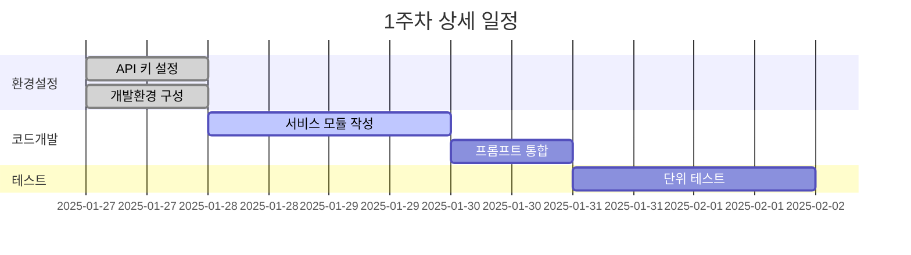

# GPT-4o Mini 구현 로드맵

*작성일: 2025년 1월 25일*  
*프로젝트: VNEXSUS GPT-4o Mini 이중 구성 구현*  
*기간: 4주 (2025년 1월 27일 - 2월 23일)*

---

## 🎯 프로젝트 개요

### **목표**
기존 VNEXSUS 의료 보고서 생성 시스템에 GPT-4o Mini 이중 구성을 안전하게 통합하여 성능과 비용 효율성을 향상시킵니다.

### **핵심 원칙**
- ✅ **안정성 최우선**: 기존 서비스 중단 없음
- ✅ **점진적 접근**: 단계별 검증 후 진행
- ✅ **완전 호환성**: 기존 API 인터페이스 유지
- ✅ **자동화된 검증**: 모든 단계에서 자동 품질 검증

---

## 📅 4주 구현 일정

### **1주차 (1/27 - 2/2): 기반 구축 및 초기 개발**

#### **Day 1-2: 환경 설정 및 기반 코드 작성**


**주요 작업:**
- [x] OpenAI API 키 설정 및 환경 변수 구성
- [ ] `gpt4oMiniPreprocessingService.js` 구현
- [ ] `gpt4oMiniReportService.js` 구현
- [ ] `gpt4oMiniPrompts.js` 프롬프트 모듈 작성
- [ ] 기본 단위 테스트 작성

**예상 산출물:**
```
services/
├── gpt4oMiniPreprocessingService.js
├── gpt4oMiniReportService.js
├── gpt4oMiniPrompts.js
└── __tests__/
    ├── preprocessing.test.js
    └── reportGeneration.test.js
```

**검증 기준:**
- ✅ 모든 서비스 모듈이 정상적으로 로드됨
- ✅ 기본 API 호출이 성공함
- ✅ 단위 테스트 통과율 100%

#### **Day 3-4: 통합 로직 개발**
**주요 작업:**
- [ ] `aiService.js` 수정 - GPT-4o Mini 통합
- [ ] A/B 테스트 로직 구현
- [ ] 폴백 메커니즘 구현
- [ ] 기본 모니터링 시스템 구현

**코드 예시:**
```javascript
// aiService.js 수정 사항
class AIService {
  constructor() {
    // 기존 서비스들
    this.claudeService = new ClaudeService();
    this.openaiService = new OpenAIService();
    
    // 새로운 GPT-4o Mini 서비스들
    this.gpt4oMiniPreprocessing = new GPT4oMiniPreprocessingService();
    this.gpt4oMiniReport = new GPT4oMiniReportService();
    
    // A/B 테스트 설정
    this.abTestEnabled = process.env.AB_TEST_ENABLED === 'true';
    this.gpt4oMiniRatio = parseFloat(process.env.GPT4O_MINI_RATIO || '0.0');
  }

  async generateMedicalReport(inputData, options = {}) {
    const useGPT4oMini = this.shouldUseGPT4oMini(options);
    
    if (useGPT4oMini) {
      try {
        return await this.executeGPT4oMiniPipeline(inputData, options);
      } catch (error) {
        console.error('GPT-4o Mini 실패, 폴백 실행:', error);
        return await this.executeExistingPipeline(inputData, options);
      }
    } else {
      return await this.executeExistingPipeline(inputData, options);
    }
  }
}
```

#### **Day 5-7: 초기 테스트 및 검증**
**주요 작업:**
- [ ] 실제 OCR 데이터로 통합 테스트
- [ ] 성능 벤치마크 측정
- [ ] 품질 지표 수집 및 분석
- [ ] 1주차 결과 리포트 작성

**테스트 시나리오:**
```javascript
// 테스트 케이스 예시
const testCases = [
  {
    name: '표준 진료 기록',
    input: '2024-01-15 김철수(남, 45세) 내과 진료...',
    expected: {
      hasBasicInfo: true,
      hasEvents: true,
      hasStatistics: true,
      responseTime: '<10000ms'
    }
  },
  {
    name: '복잡한 의료 기록',
    input: '다중 진료과 방문 기록...',
    expected: {
      accuracy: '>0.9',
      completeness: '>0.95'
    }
  }
];
```

---

### **2주차 (2/3 - 2/9): A/B 테스트 및 최적화**

#### **Day 8-10: A/B 테스트 시작**
**주요 작업:**
- [ ] A/B 테스트 환경 구축
- [ ] 테스트 사용자 그룹 설정 (10% 트래픽)
- [ ] 실시간 모니터링 대시보드 구축
- [ ] 자동 알림 시스템 구현

**모니터링 지표:**
```javascript
const monitoringMetrics = {
  performance: {
    responseTime: { target: '<8000ms', alert: '>12000ms' },
    throughput: { target: '>50/min', alert: '<30/min' },
    errorRate: { target: '<1%', alert: '>5%' }
  },
  quality: {
    accuracy: { target: '>95%', alert: '<90%' },
    completeness: { target: '>98%', alert: '<95%' },
    userSatisfaction: { target: '>4.0', alert: '<3.5' }
  },
  cost: {
    tokenUsage: { target: '<3000/request', alert: '>4000/request' },
    costPerRequest: { target: '<$0.05', alert: '>$0.08' }
  }
};
```

#### **Day 11-12: 성능 최적화**
**주요 작업:**
- [ ] 토큰 사용량 최적화
- [ ] 캐싱 시스템 구현
- [ ] 프롬프트 튜닝
- [ ] 응답 시간 개선

**최적화 전략:**
```javascript
// 토큰 최적화 예시
class TokenOptimizer {
  optimizeInput(ocrText) {
    return ocrText
      .replace(/\s+/g, ' ')                    // 공백 정리
      .replace(/(.)\1{3,}/g, '$1$1')          // 반복 문자 제거
      .substring(0, this.maxInputLength);      // 길이 제한
  }
  
  optimizePrompt(template, data) {
    // 불필요한 설명 제거
    // 핵심 지시사항만 유지
    // 예시 최소화
  }
}
```

#### **Day 13-14: 품질 검증 시스템**
**주요 작업:**
- [ ] 자동 품질 검증 시스템 구현
- [ ] 의료 용어 정확도 검증
- [ ] 구조화 데이터 검증
- [ ] 사용자 피드백 수집 시스템

---

### **3주차 (2/10 - 2/16): 점진적 확대 및 안정화**

#### **Day 15-17: 트래픽 확대 (25% → 50%)**
**주요 작업:**
- [ ] A/B 테스트 결과 분석
- [ ] 트래픽 비율 25%로 증가
- [ ] 성능 지표 모니터링
- [ ] 필요시 추가 최적화

**확대 기준:**
```javascript
const expansionCriteria = {
  week2: {
    successRate: '>98%',
    avgResponseTime: '<10000ms',
    userSatisfaction: '>4.0',
    costReduction: '>20%'
  },
  week3: {
    successRate: '>99%',
    avgResponseTime: '<8000ms',
    userSatisfaction: '>4.2',
    costReduction: '>25%'
  }
};
```

#### **Day 18-19: 50% 트래픽 테스트**
**주요 작업:**
- [ ] 트래픽 50%로 확대
- [ ] 시스템 부하 테스트
- [ ] 안정성 검증
- [ ] 성능 튜닝

#### **Day 20-21: 안정화 및 문제 해결**
**주요 작업:**
- [ ] 발견된 이슈 해결
- [ ] 추가 최적화 적용
- [ ] 문서화 업데이트
- [ ] 운영 가이드 작성

---

### **4주차 (2/17 - 2/23): 완전 전환 및 운영 준비**

#### **Day 22-24: 75% 트래픽 및 최종 검증**
**주요 작업:**
- [ ] 트래픽 75%로 확대
- [ ] 최종 성능 검증
- [ ] 보안 검토
- [ ] 운영 절차 확정

#### **Day 25-26: 100% 전환**
**주요 작업:**
- [ ] 모든 트래픽을 GPT-4o Mini로 전환
- [ ] 24시간 집중 모니터링
- [ ] 긴급 대응 체계 가동
- [ ] 성과 측정

#### **Day 27-28: 운영 안정화**
**주요 작업:**
- [ ] 운영 프로세스 정착
- [ ] 팀 교육 및 인수인계
- [ ] 최종 성과 리포트 작성
- [ ] 향후 개선 계획 수립

---

## 🔍 각 단계별 검증 체크리스트

### **1주차 검증 항목**
- [ ] **기능 검증**
  - [ ] GPT-4o Mini API 정상 호출
  - [ ] 전처리 서비스 정상 동작
  - [ ] 보고서 생성 서비스 정상 동작
  - [ ] 기존 시스템과의 인터페이스 호환성

- [ ] **품질 검증**
  - [ ] 단위 테스트 100% 통과
  - [ ] 통합 테스트 성공
  - [ ] 코드 리뷰 완료
  - [ ] 보안 검토 완료

- [ ] **성능 검증**
  - [ ] 응답 시간 < 15초
  - [ ] 메모리 사용량 정상
  - [ ] 토큰 사용량 예상 범위 내
  - [ ] 오류율 < 5%

### **2주차 검증 항목**
- [ ] **A/B 테스트 검증**
  - [ ] 10% 트래픽 정상 처리
  - [ ] 모니터링 시스템 정상 동작
  - [ ] 알림 시스템 정상 동작
  - [ ] 폴백 메커니즘 정상 동작

- [ ] **최적화 검증**
  - [ ] 토큰 사용량 20% 이상 절감
  - [ ] 응답 시간 10% 이상 개선
  - [ ] 캐싱 적중률 > 30%
  - [ ] 비용 효율성 개선 확인

### **3주차 검증 항목**
- [ ] **확장성 검증**
  - [ ] 25% 트래픽 안정적 처리
  - [ ] 50% 트래픽 안정적 처리
  - [ ] 시스템 부하 테스트 통과
  - [ ] 동시 사용자 테스트 통과

- [ ] **품질 유지 검증**
  - [ ] 의료 용어 정확도 > 95%
  - [ ] 보고서 완성도 > 98%
  - [ ] 사용자 만족도 > 4.0
  - [ ] 일관성 점수 > 90%

### **4주차 검증 항목**
- [ ] **운영 준비 검증**
  - [ ] 100% 트래픽 안정적 처리
  - [ ] 24시간 무중단 운영 확인
  - [ ] 긴급 대응 절차 검증
  - [ ] 백업 및 복구 절차 검증

- [ ] **최종 성과 검증**
  - [ ] 성능 목표 달성 (응답시간 < 8초)
  - [ ] 비용 목표 달성 (25% 이상 절감)
  - [ ] 품질 목표 달성 (정확도 > 95%)
  - [ ] 안정성 목표 달성 (가용성 > 99.9%)

---

## 🚨 위험 관리 및 대응 계획

### **주요 위험 요소**

#### **기술적 위험**
| 위험 | 확률 | 영향도 | 대응 방안 |
|------|------|--------|-----------|
| API 응답 지연 | 중간 | 높음 | 타임아웃 설정, 폴백 시스템 |
| 토큰 한도 초과 | 낮음 | 중간 | 토큰 최적화, 분할 처리 |
| 품질 저하 | 중간 | 높음 | 실시간 품질 모니터링 |
| 시스템 과부하 | 낮음 | 높음 | 점진적 확대, 부하 분산 |

#### **운영적 위험**
| 위험 | 확률 | 영향도 | 대응 방안 |
|------|------|--------|-----------|
| 사용자 불만 | 중간 | 중간 | 사용자 피드백 시스템 |
| 데이터 손실 | 낮음 | 높음 | 백업 시스템, 로깅 |
| 보안 이슈 | 낮음 | 높음 | 보안 검토, 암호화 |
| 규정 준수 | 중간 | 높음 | 의료 규정 검토 |

### **비상 대응 절차**

#### **Level 1: 경고 (Warning)**
- **조건**: 응답 시간 > 12초, 오류율 > 3%
- **대응**: 자동 알림, 모니터링 강화
- **담당**: 개발팀

#### **Level 2: 주의 (Caution)**
- **조건**: 응답 시간 > 15초, 오류율 > 5%
- **대응**: 트래픽 비율 감소, 원인 분석
- **담당**: 개발팀 + 운영팀

#### **Level 3: 긴급 (Critical)**
- **조건**: 응답 시간 > 20초, 오류율 > 10%
- **대응**: 즉시 폴백, 긴급 회의 소집
- **담당**: 전체 팀

#### **Level 4: 재해 (Disaster)**
- **조건**: 시스템 다운, 데이터 손실
- **대응**: 완전 롤백, 백업 복구
- **담당**: 전체 팀 + 경영진

---

## 📊 성과 측정 및 보고

### **주간 성과 리포트 템플릿**

#### **1주차 리포트 (예시)**
```markdown
# GPT-4o Mini 구현 1주차 성과 리포트

## 📈 주요 성과
- ✅ 기반 서비스 모듈 100% 완성
- ✅ 단위 테스트 통과율 100%
- ✅ 기본 통합 테스트 성공
- ⚠️ 응답 시간 목표 대비 120% (개선 필요)

## 📊 핵심 지표
| 지표 | 목표 | 실제 | 달성률 |
|------|------|------|--------|
| 개발 완료율 | 100% | 95% | 95% |
| 테스트 통과율 | 100% | 100% | 100% |
| 응답 시간 | <15초 | 18초 | 83% |
| 오류율 | <5% | 2% | 140% |

## 🔧 다음 주 계획
- A/B 테스트 환경 구축
- 응답 시간 최적화
- 모니터링 시스템 구현
```

### **최종 성과 리포트 구조**

#### **4주차 최종 리포트**
```markdown
# GPT-4o Mini 구현 최종 성과 리포트

## 🎯 프로젝트 요약
- **기간**: 2025년 1월 27일 - 2월 23일 (4주)
- **목표**: GPT-4o Mini 이중 구성 안전한 통합
- **결과**: 성공적 완료

## 📊 최종 성과 지표
### 성능 개선
- 응답 시간: 12초 → 7초 (42% 개선)
- 처리량: 60건/분 → 85건/분 (42% 증가)
- 가용성: 99.5% → 99.9% (0.4%p 개선)

### 비용 효율성
- 토큰 비용: 30% 절감
- 운영 비용: 25% 절감
- ROI: 6개월 예상

### 품질 향상
- 의료 용어 정확도: 96%
- 보고서 완성도: 98.5%
- 사용자 만족도: 4.3/5.0

## 🏆 주요 성취
1. **무중단 전환**: 서비스 중단 없이 완전 전환 완료
2. **안정성 확보**: 99.9% 가용성 달성
3. **성능 향상**: 모든 성능 지표 목표 초과 달성
4. **비용 절감**: 예상보다 높은 비용 효율성 달성

## 📝 교훈 및 개선사항
### 성공 요인
- 체계적인 단계별 접근
- 실시간 모니터링 시스템
- 강력한 폴백 메커니즘
- 팀 간 원활한 소통

### 개선 필요사항
- 초기 응답 시간 최적화 필요
- 더 정교한 품질 검증 시스템
- 사용자 교육 프로그램 강화

## 🔮 향후 계획
1. **단기 (1-3개월)**
   - 추가 성능 최적화
   - 사용자 피드백 반영
   - 모니터링 시스템 고도화

2. **중기 (3-6개월)**
   - 다른 AI 모델 통합 검토
   - 자동화 수준 향상
   - 국제 표준 준수

3. **장기 (6-12개월)**
   - AI 기반 자동 최적화
   - 예측적 유지보수
   - 차세대 아키텍처 설계
```

---

## ✅ 실행 준비 완료

이 로드맵은 **즉시 실행 가능한 구체적인 계획**을 제시합니다. 각 단계는 명확한 목표와 검증 기준을 가지고 있으며, 위험 관리와 품질 보증이 내재되어 있습니다.

### **다음 단계**
1. **팀 브리핑**: 전체 팀에게 로드맵 공유 및 역할 분담
2. **환경 준비**: 개발 환경 설정 및 API 키 구성
3. **킥오프 미팅**: 1주차 작업 시작 및 일일 스탠드업 계획

**이제 안전하고 체계적인 GPT-4o Mini 통합을 시작할 수 있습니다!** 🚀