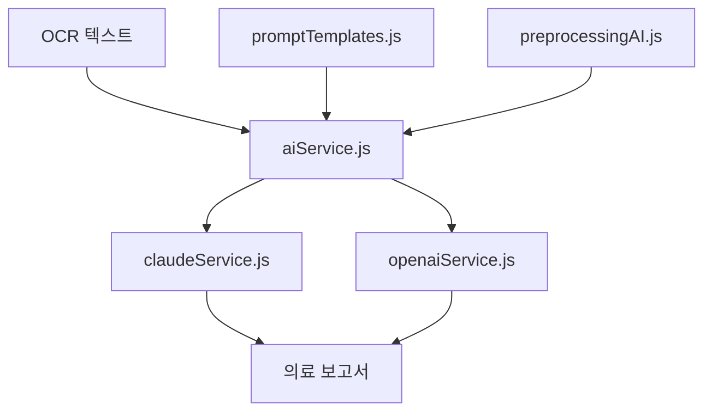
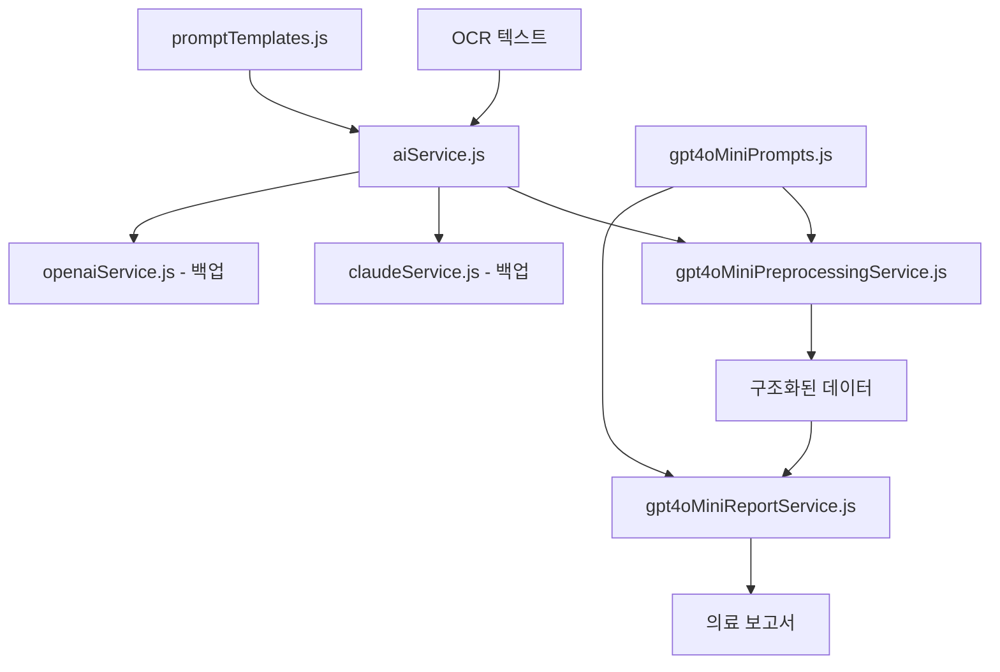

# GPT-4o Mini 시스템 통합 계획서

*작성일: 2025년 1월 25일*  
*대상: VNEXSUS 의료 보고서 생성 시스템*  
*목적: 기존 시스템과의 안전한 통합 및 무중단 전환*

---

## 📋 통합 개요

### **통합 목표**
- ✅ **무중단 서비스**: 기존 서비스 중단 없이 GPT-4o Mini 도입
- ✅ **안정성 보장**: 기존 시스템의 안정성 유지 및 향상
- ✅ **성능 개선**: 처리 속도 및 비용 효율성 향상
- ✅ **호환성 유지**: 기존 API 인터페이스 완전 호환
- ✅ **점진적 전환**: 단계별 안전한 마이그레이션

### **현재 시스템 구조**


### **목표 시스템 구조**


---

## 🔧 1단계: 기존 시스템 분석 및 준비

### **1.1 현재 시스템 의존성 분석**

#### **핵심 모듈 분석**
```javascript
// 현재 aiService.js의 주요 메서드
class AIService {
  async generateMedicalReport(inputData, options) {
    // Claude 또는 OpenAI 서비스 호출
  }
  
  async executeCustomPrompt(promptData) {
    // 사용자 정의 프롬프트 실행
  }
  
  async processLongDocument(document) {
    // 긴 문서 처리
  }
}
```

#### **기존 인터페이스 호환성 매트릭스**
| 메서드 | 입력 형식 | 출력 형식 | GPT-4o Mini 호환성 | 수정 필요도 |
|--------|-----------|-----------|-------------------|-------------|
| `generateMedicalReport` | Object | String (Markdown) | ✅ 호환 | 낮음 |
| `executeCustomPrompt` | Object | String | ✅ 호환 | 낮음 |
| `processLongDocument` | String | Object | ⚠️ 부분 호환 | 중간 |
| `buildMedicalReportPrompt` | Object | String | ❌ 비호환 | 높음 |

### **1.2 새로운 서비스 모듈 설계**

#### **GPT-4o Mini 전처리 서비스**
```javascript
// gpt4oMiniPreprocessingService.js
class GPT4oMiniPreprocessingService {
  constructor() {
    this.apiKey = process.env.OPENAI_API_KEY;
    this.model = 'gpt-4o-mini';
    this.prompts = require('./gpt4oMiniPrompts');
  }

  async preprocessOCRText(ocrText, options = {}) {
    const prompt = this.buildPreprocessingPrompt(ocrText, options);
    
    try {
      const response = await this.callOpenAI(prompt);
      return this.validateAndParseResponse(response);
    } catch (error) {
      console.error('전처리 실패:', error);
      throw new Error('OCR 텍스트 전처리 실패');
    }
  }

  buildPreprocessingPrompt(ocrText, options) {
    const systemPrompt = this.prompts.preprocessing.system;
    const userPrompt = this.prompts.preprocessing.user
      .replace('{OCR_TEXT}', ocrText)
      .replace('{PATIENT_NAME}', options.patientName || '')
      .replace('{ENROLLMENT_DATE}', options.enrollmentDate || '');
    
    return { systemPrompt, userPrompt };
  }

  async validateAndParseResponse(response) {
    try {
      const parsedData = JSON.parse(response);
      
      // JSON 스키마 검증
      if (!this.validateJSONSchema(parsedData)) {
        throw new Error('응답 형식이 올바르지 않습니다');
      }
      
      return parsedData;
    } catch (error) {
      console.error('응답 파싱 실패:', error);
      throw new Error('AI 응답 처리 실패');
    }
  }
}
```

#### **GPT-4o Mini 보고서 생성 서비스**
```javascript
// gpt4oMiniReportService.js
class GPT4oMiniReportService {
  constructor() {
    this.apiKey = process.env.OPENAI_API_KEY;
    this.model = 'gpt-4o-mini';
    this.prompts = require('./gpt4oMiniPrompts');
  }

  async generateMedicalReport(structuredData, options = {}) {
    const prompt = this.buildReportPrompt(structuredData, options);
    
    try {
      const response = await this.callOpenAI(prompt);
      return this.formatResponse(response, options);
    } catch (error) {
      console.error('보고서 생성 실패:', error);
      throw new Error('의료 보고서 생성 실패');
    }
  }

  buildReportPrompt(structuredData, options) {
    let template = this.prompts.report.basic;
    
    // 특화 모드 선택
    if (options.mode === 'insurance') {
      template = this.prompts.report.insurance;
    } else if (options.mode === 'medical') {
      template = this.prompts.report.medical;
    } else if (options.mode === 'summary') {
      template = this.prompts.report.summary;
    }

    const systemPrompt = template.system;
    const userPrompt = template.user
      .replace('{STRUCTURED_MEDICAL_DATA}', JSON.stringify(structuredData, null, 2));
    
    return { systemPrompt, userPrompt };
  }

  formatResponse(response, options) {
    // 마크다운 형식 검증 및 정리
    let formattedResponse = response.trim();
    
    // 메타데이터 추가
    const metadata = {
      generatedAt: new Date().toISOString(),
      model: this.model,
      mode: options.mode || 'basic',
      version: '1.0'
    };
    
    return {
      content: formattedResponse,
      metadata: metadata
    };
  }
}
```

---

## 🔄 2단계: 점진적 통합 전략

### **2.1 Phase 1: 병렬 운영 (A/B 테스트)**

#### **기간**: 1주차
#### **목표**: 기존 시스템과 병렬로 GPT-4o Mini 테스트

```javascript
// aiService.js 수정 - A/B 테스트 로직 추가
class AIService {
  constructor() {
    this.claudeService = new ClaudeService();
    this.openaiService = new OpenAIService();
    this.gpt4oMiniPreprocessing = new GPT4oMiniPreprocessingService();
    this.gpt4oMiniReport = new GPT4oMiniReportService();
    
    // A/B 테스트 설정
    this.abTestConfig = {
      enabled: process.env.AB_TEST_ENABLED === 'true',
      gpt4oMiniRatio: parseFloat(process.env.GPT4O_MINI_RATIO || '0.1'), // 10%
      testUsers: new Set(process.env.TEST_USERS?.split(',') || [])
    };
  }

  async generateMedicalReport(inputData, options = {}) {
    const useGPT4oMini = this.shouldUseGPT4oMini(options);
    
    if (useGPT4oMini) {
      try {
        // GPT-4o Mini 파이프라인 실행
        const result = await this.executeGPT4oMiniPipeline(inputData, options);
        
        // 병렬로 기존 시스템도 실행하여 결과 비교 (로깅용)
        this.executeParallelComparison(inputData, options, result);
        
        return result;
      } catch (error) {
        console.error('GPT-4o Mini 실패, 기존 시스템으로 폴백:', error);
        return await this.executeExistingPipeline(inputData, options);
      }
    } else {
      return await this.executeExistingPipeline(inputData, options);
    }
  }

  shouldUseGPT4oMini(options) {
    if (!this.abTestConfig.enabled) return false;
    
    // 테스트 사용자인 경우
    if (options.userId && this.abTestConfig.testUsers.has(options.userId)) {
      return true;
    }
    
    // 랜덤 샘플링
    return Math.random() < this.abTestConfig.gpt4oMiniRatio;
  }

  async executeGPT4oMiniPipeline(inputData, options) {
    // 1단계: OCR 텍스트 전처리
    const structuredData = await this.gpt4oMiniPreprocessing
      .preprocessOCRText(inputData.ocrText, options);
    
    // 2단계: 보고서 생성
    const report = await this.gpt4oMiniReport
      .generateMedicalReport(structuredData, options);
    
    return {
      content: report.content,
      metadata: {
        ...report.metadata,
        pipeline: 'gpt-4o-mini',
        structuredData: structuredData
      }
    };
  }

  async executeExistingPipeline(inputData, options) {
    // 기존 Claude/OpenAI 파이프라인
    if (options.provider === 'openai') {
      return await this.openaiService.generateMedicalReport(inputData, options);
    } else {
      return await this.claudeService.generateMedicalReport(inputData, options);
    }
  }

  async executeParallelComparison(inputData, options, gpt4oResult) {
    try {
      const existingResult = await this.executeExistingPipeline(inputData, options);
      
      // 결과 비교 및 로깅
      this.logComparisonResults({
        input: inputData,
        gpt4oResult: gpt4oResult,
        existingResult: existingResult,
        timestamp: new Date().toISOString()
      });
    } catch (error) {
      console.error('병렬 비교 실행 실패:', error);
    }
  }
}
```

#### **A/B 테스트 모니터링**
```javascript
// abTestMonitor.js
class ABTestMonitor {
  constructor() {
    this.metrics = {
      gpt4oMini: { requests: 0, successes: 0, failures: 0, avgTime: 0 },
      existing: { requests: 0, successes: 0, failures: 0, avgTime: 0 }
    };
  }

  recordRequest(pipeline, success, responseTime) {
    const metric = this.metrics[pipeline];
    metric.requests++;
    
    if (success) {
      metric.successes++;
    } else {
      metric.failures++;
    }
    
    // 평균 응답 시간 계산
    metric.avgTime = (metric.avgTime * (metric.requests - 1) + responseTime) / metric.requests;
  }

  getComparisonReport() {
    return {
      gpt4oMini: {
        successRate: this.metrics.gpt4oMini.successes / this.metrics.gpt4oMini.requests,
        avgResponseTime: this.metrics.gpt4oMini.avgTime,
        totalRequests: this.metrics.gpt4oMini.requests
      },
      existing: {
        successRate: this.metrics.existing.successes / this.metrics.existing.requests,
        avgResponseTime: this.metrics.existing.avgTime,
        totalRequests: this.metrics.existing.requests
      }
    };
  }
}
```

### **2.2 Phase 2: 점진적 확대 (25% → 50% → 75%)**

#### **기간**: 2-3주차
#### **목표**: 성공적인 A/B 테스트 결과를 바탕으로 점진적 확대

```javascript
// 점진적 확대 설정
const rolloutSchedule = {
  week2: { ratio: 0.25, criteria: 'successRate >= 0.98 && avgTime <= 10000' },
  week3: { ratio: 0.50, criteria: 'successRate >= 0.99 && avgTime <= 8000' },
  week4: { ratio: 0.75, criteria: 'successRate >= 0.995 && avgTime <= 6000' }
};

class GradualRollout {
  constructor() {
    this.currentWeek = this.getCurrentWeek();
    this.monitor = new ABTestMonitor();
  }

  shouldProceedToNextPhase() {
    const currentConfig = rolloutSchedule[`week${this.currentWeek}`];
    if (!currentConfig) return false;

    const metrics = this.monitor.getComparisonReport();
    const gpt4oMetrics = metrics.gpt4oMini;

    // 성공 기준 평가
    return eval(currentConfig.criteria.replace(/successRate/g, gpt4oMetrics.successRate)
                                    .replace(/avgTime/g, gpt4oMetrics.avgResponseTime));
  }

  async updateRolloutRatio() {
    if (this.shouldProceedToNextPhase()) {
      const nextWeek = this.currentWeek + 1;
      const nextConfig = rolloutSchedule[`week${nextWeek}`];
      
      if (nextConfig) {
        await this.updateEnvironmentVariable('GPT4O_MINI_RATIO', nextConfig.ratio);
        console.log(`롤아웃 비율을 ${nextConfig.ratio * 100}%로 증가`);
      }
    }
  }
}
```

### **2.3 Phase 3: 완전 전환**

#### **기간**: 4주차
#### **목표**: 모든 트래픽을 GPT-4o Mini로 전환

```javascript
// 완전 전환 후 설정
class FullMigration {
  constructor() {
    this.fallbackEnabled = true;
    this.fallbackThreshold = 3; // 3회 연속 실패 시 폴백
    this.consecutiveFailures = 0;
  }

  async generateMedicalReport(inputData, options = {}) {
    try {
      const result = await this.executeGPT4oMiniPipeline(inputData, options);
      this.consecutiveFailures = 0; // 성공 시 카운터 리셋
      return result;
    } catch (error) {
      this.consecutiveFailures++;
      
      if (this.fallbackEnabled && this.consecutiveFailures >= this.fallbackThreshold) {
        console.warn(`GPT-4o Mini ${this.consecutiveFailures}회 연속 실패, 폴백 활성화`);
        return await this.executeExistingPipeline(inputData, options);
      } else {
        throw error;
      }
    }
  }
}
```

---

## 🛡️ 3단계: 안전장치 및 모니터링

### **3.1 실시간 모니터링 시스템**

#### **핵심 모니터링 지표**
```javascript
// monitoringService.js
class MonitoringService {
  constructor() {
    this.metrics = {
      requests: new Map(),
      responses: new Map(),
      errors: new Map(),
      performance: new Map()
    };
    
    this.alerts = {
      errorRate: 0.05,      // 5% 이상 오류율
      responseTime: 15000,  // 15초 이상 응답 시간
      queueLength: 100      // 대기열 100개 이상
    };
  }

  recordRequest(requestId, pipeline, startTime) {
    this.metrics.requests.set(requestId, {
      pipeline,
      startTime,
      status: 'processing'
    });
  }

  recordResponse(requestId, success, responseTime, error = null) {
    const request = this.metrics.requests.get(requestId);
    if (!request) return;

    request.status = success ? 'success' : 'error';
    request.responseTime = responseTime;
    request.error = error;

    // 성능 메트릭 업데이트
    this.updatePerformanceMetrics(request.pipeline, success, responseTime);
    
    // 알림 체크
    this.checkAlerts();
  }

  updatePerformanceMetrics(pipeline, success, responseTime) {
    if (!this.metrics.performance.has(pipeline)) {
      this.metrics.performance.set(pipeline, {
        totalRequests: 0,
        successCount: 0,
        totalResponseTime: 0,
        recentErrors: []
      });
    }

    const metrics = this.metrics.performance.get(pipeline);
    metrics.totalRequests++;
    
    if (success) {
      metrics.successCount++;
      metrics.totalResponseTime += responseTime;
    } else {
      metrics.recentErrors.push({
        timestamp: Date.now(),
        responseTime
      });
      
      // 최근 1시간 오류만 유지
      const oneHourAgo = Date.now() - 3600000;
      metrics.recentErrors = metrics.recentErrors.filter(e => e.timestamp > oneHourAgo);
    }
  }

  checkAlerts() {
    const gpt4oMetrics = this.metrics.performance.get('gpt-4o-mini');
    if (!gpt4oMetrics) return;

    const errorRate = gpt4oMetrics.recentErrors.length / gpt4oMetrics.totalRequests;
    const avgResponseTime = gpt4oMetrics.totalResponseTime / gpt4oMetrics.successCount;

    if (errorRate > this.alerts.errorRate) {
      this.sendAlert('HIGH_ERROR_RATE', `오류율 ${(errorRate * 100).toFixed(2)}% 초과`);
    }

    if (avgResponseTime > this.alerts.responseTime) {
      this.sendAlert('SLOW_RESPONSE', `평균 응답 시간 ${avgResponseTime}ms 초과`);
    }
  }

  sendAlert(type, message) {
    console.error(`[ALERT] ${type}: ${message}`);
    
    // 실제 환경에서는 Slack, 이메일 등으로 알림 발송
    // await this.notificationService.send({
    //   type,
    //   message,
    //   timestamp: new Date().toISOString()
    // });
  }

  getDashboardData() {
    const data = {};
    
    for (const [pipeline, metrics] of this.metrics.performance) {
      data[pipeline] = {
        successRate: metrics.successCount / metrics.totalRequests,
        avgResponseTime: metrics.totalResponseTime / metrics.successCount,
        totalRequests: metrics.totalRequests,
        recentErrorCount: metrics.recentErrors.length
      };
    }
    
    return data;
  }
}
```

### **3.2 자동 폴백 시스템**

#### **지능형 폴백 로직**
```javascript
// fallbackManager.js
class FallbackManager {
  constructor() {
    this.fallbackRules = [
      {
        condition: 'consecutiveFailures >= 3',
        action: 'switchToBackup',
        duration: 300000 // 5분
      },
      {
        condition: 'errorRate > 0.1',
        action: 'reduceTraffic',
        duration: 600000 // 10분
      },
      {
        condition: 'avgResponseTime > 20000',
        action: 'enableCaching',
        duration: 900000 // 15분
      }
    ];
    
    this.currentState = 'normal';
    this.backupServices = ['claude', 'openai'];
  }

  async evaluateAndExecute(metrics) {
    for (const rule of this.fallbackRules) {
      if (this.evaluateCondition(rule.condition, metrics)) {
        await this.executeAction(rule.action, rule.duration);
        break;
      }
    }
  }

  evaluateCondition(condition, metrics) {
    // 조건 평가 로직
    const context = {
      consecutiveFailures: metrics.consecutiveFailures || 0,
      errorRate: metrics.errorRate || 0,
      avgResponseTime: metrics.avgResponseTime || 0
    };
    
    return eval(condition.replace(/(\w+)/g, (match) => context[match] || 0));
  }

  async executeAction(action, duration) {
    switch (action) {
      case 'switchToBackup':
        await this.switchToBackupService(duration);
        break;
      case 'reduceTraffic':
        await this.reduceTrafficToGPT4oMini(0.5, duration);
        break;
      case 'enableCaching':
        await this.enableAggressiveCaching(duration);
        break;
    }
  }

  async switchToBackupService(duration) {
    console.log(`백업 서비스로 전환 (${duration}ms 동안)`);
    
    // 환경 변수 임시 변경
    process.env.GPT4O_MINI_ENABLED = 'false';
    process.env.FALLBACK_SERVICE = 'claude';
    
    // 지정된 시간 후 복구
    setTimeout(() => {
      process.env.GPT4O_MINI_ENABLED = 'true';
      delete process.env.FALLBACK_SERVICE;
      console.log('GPT-4o Mini 서비스 복구');
    }, duration);
  }
}
```

### **3.3 품질 보증 시스템**

#### **실시간 품질 검증**
```javascript
// qualityAssurance.js
class QualityAssurance {
  constructor() {
    this.qualityThresholds = {
      minConfidence: 0.7,
      maxResponseTime: 10000,
      requiredFields: ['basic_info', 'events', 'statistics'],
      dateFormatRegex: /^\d{4}-\d{2}-\d{2}$/
    };
  }

  async validateResponse(response, requestMetadata) {
    const validationResults = {
      passed: true,
      score: 1.0,
      issues: []
    };

    // 1. 응답 시간 검증
    if (requestMetadata.responseTime > this.qualityThresholds.maxResponseTime) {
      validationResults.issues.push('응답 시간 초과');
      validationResults.score -= 0.2;
    }

    // 2. 데이터 구조 검증
    if (response.structuredData) {
      const structureValid = this.validateDataStructure(response.structuredData);
      if (!structureValid.passed) {
        validationResults.issues.push(...structureValid.issues);
        validationResults.score -= 0.3;
      }
    }

    // 3. 내용 품질 검증
    const contentQuality = this.validateContentQuality(response.content);
    if (contentQuality.score < 0.8) {
      validationResults.issues.push('내용 품질 기준 미달');
      validationResults.score -= 0.2;
    }

    // 4. 최종 판정
    validationResults.passed = validationResults.score >= 0.7;

    return validationResults;
  }

  validateDataStructure(data) {
    const results = { passed: true, issues: [] };

    // 필수 필드 검증
    for (const field of this.qualityThresholds.requiredFields) {
      if (!data[field]) {
        results.issues.push(`필수 필드 누락: ${field}`);
        results.passed = false;
      }
    }

    // 날짜 형식 검증
    if (data.events) {
      for (const event of data.events) {
        if (event.date && !this.qualityThresholds.dateFormatRegex.test(event.date)) {
          results.issues.push(`잘못된 날짜 형식: ${event.date}`);
          results.passed = false;
        }
      }
    }

    return results;
  }

  validateContentQuality(content) {
    let score = 1.0;
    const issues = [];

    // 길이 검증
    if (content.length < 500) {
      score -= 0.2;
      issues.push('내용이 너무 짧음');
    }

    // 구조 검증 (마크다운 헤더 존재)
    const headerCount = (content.match(/^#+\s/gm) || []).length;
    if (headerCount < 3) {
      score -= 0.1;
      issues.push('구조화 부족');
    }

    // 의료 용어 검증 (간단한 키워드 체크)
    const medicalTerms = ['진료', '진단', '처방', '검사', '병원', '의료'];
    const termCount = medicalTerms.filter(term => content.includes(term)).length;
    if (termCount < 3) {
      score -= 0.2;
      issues.push('의료 관련 내용 부족');
    }

    return { score, issues };
  }
}
```

---

## 📊 4단계: 성능 최적화 및 비용 관리

### **4.1 토큰 사용량 최적화**

#### **동적 프롬프트 조정**
```javascript
// tokenOptimizer.js
class TokenOptimizer {
  constructor() {
    this.tokenLimits = {
      preprocessing: 4000,
      reportGeneration: 3500
    };
    
    this.compressionStrategies = {
      removeRedundancy: true,
      summarizeNonCritical: true,
      useAbbreviations: false
    };
  }

  optimizePreprocessingInput(ocrText, options) {
    let optimizedText = ocrText;
    
    // 1. 중복 제거
    if (this.compressionStrategies.removeRedundancy) {
      optimizedText = this.removeDuplicateLines(optimizedText);
    }
    
    // 2. 노이즈 제거
    optimizedText = this.removeOCRNoise(optimizedText);
    
    // 3. 길이 제한
    const tokenCount = this.estimateTokenCount(optimizedText);
    if (tokenCount > this.tokenLimits.preprocessing) {
      optimizedText = this.truncateIntelligently(optimizedText, this.tokenLimits.preprocessing);
    }
    
    return optimizedText;
  }

  removeDuplicateLines(text) {
    const lines = text.split('\n');
    const uniqueLines = [...new Set(lines)];
    return uniqueLines.join('\n');
  }

  removeOCRNoise(text) {
    return text
      .replace(/[^\w\s가-힣.,:()\-\/]/g, '') // 특수문자 제거
      .replace(/\s+/g, ' ') // 연속 공백 제거
      .replace(/(.)\1{3,}/g, '$1$1') // 연속 문자 제한
      .trim();
  }

  estimateTokenCount(text) {
    // 한국어 기준 대략적인 토큰 수 계산
    return Math.ceil(text.length / 3);
  }

  truncateIntelligently(text, maxTokens) {
    const maxLength = maxTokens * 3;
    if (text.length <= maxLength) return text;
    
    // 의료 관련 키워드가 포함된 문장 우선 보존
    const sentences = text.split(/[.!?]\s+/);
    const medicalKeywords = ['진료', '진단', '처방', '검사', '병원', '의료', '환자'];
    
    const prioritizedSentences = sentences.sort((a, b) => {
      const aScore = medicalKeywords.filter(keyword => a.includes(keyword)).length;
      const bScore = medicalKeywords.filter(keyword => b.includes(keyword)).length;
      return bScore - aScore;
    });
    
    let result = '';
    for (const sentence of prioritizedSentences) {
      if ((result + sentence).length > maxLength) break;
      result += sentence + '. ';
    }
    
    return result.trim();
  }
}
```

### **4.2 캐싱 시스템**

#### **지능형 캐싱 전략**
```javascript
// cachingService.js
class CachingService {
  constructor() {
    this.cache = new Map();
    this.cacheStats = {
      hits: 0,
      misses: 0,
      saves: 0
    };
    
    this.cacheConfig = {
      maxSize: 1000,
      ttl: 3600000, // 1시간
      similarityThreshold: 0.85
    };
  }

  generateCacheKey(input, options) {
    // 입력 데이터의 해시 생성
    const crypto = require('crypto');
    const inputString = JSON.stringify({ input, options });
    return crypto.createHash('md5').update(inputString).digest('hex');
  }

  async get(input, options) {
    const key = this.generateCacheKey(input, options);
    const cached = this.cache.get(key);
    
    if (cached && Date.now() - cached.timestamp < this.cacheConfig.ttl) {
      this.cacheStats.hits++;
      return cached.data;
    }
    
    // 유사한 캐시 항목 검색
    const similarCache = this.findSimilarCache(input);
    if (similarCache) {
      this.cacheStats.hits++;
      return similarCache.data;
    }
    
    this.cacheStats.misses++;
    return null;
  }

  set(input, options, data) {
    const key = this.generateCacheKey(input, options);
    
    // 캐시 크기 제한
    if (this.cache.size >= this.cacheConfig.maxSize) {
      this.evictOldest();
    }
    
    this.cache.set(key, {
      data,
      timestamp: Date.now(),
      input,
      options
    });
    
    this.cacheStats.saves++;
  }

  findSimilarCache(input) {
    for (const [key, cached] of this.cache.entries()) {
      const similarity = this.calculateSimilarity(input, cached.input);
      if (similarity >= this.cacheConfig.similarityThreshold) {
        return cached;
      }
    }
    return null;
  }

  calculateSimilarity(input1, input2) {
    // 간단한 문자열 유사도 계산 (Jaccard 유사도)
    const set1 = new Set(input1.toLowerCase().split(/\s+/));
    const set2 = new Set(input2.toLowerCase().split(/\s+/));
    
    const intersection = new Set([...set1].filter(x => set2.has(x)));
    const union = new Set([...set1, ...set2]);
    
    return intersection.size / union.size;
  }

  evictOldest() {
    let oldestKey = null;
    let oldestTime = Date.now();
    
    for (const [key, cached] of this.cache.entries()) {
      if (cached.timestamp < oldestTime) {
        oldestTime = cached.timestamp;
        oldestKey = key;
      }
    }
    
    if (oldestKey) {
      this.cache.delete(oldestKey);
    }
  }

  getStats() {
    const hitRate = this.cacheStats.hits / (this.cacheStats.hits + this.cacheStats.misses);
    return {
      ...this.cacheStats,
      hitRate: hitRate || 0,
      cacheSize: this.cache.size
    };
  }
}
```

---

## 🔧 5단계: 배포 및 운영 준비

### **5.1 환경 설정 관리**

#### **환경별 설정 파일**
```javascript
// config/development.js
module.exports = {
  gpt4oMini: {
    enabled: true,
    apiKey: process.env.OPENAI_API_KEY_DEV,
    model: 'gpt-4o-mini',
    maxTokens: 4000,
    temperature: 0.1,
    timeout: 30000
  },
  
  abTest: {
    enabled: true,
    ratio: 0.1,
    testUsers: ['dev-user-1', 'dev-user-2']
  },
  
  monitoring: {
    enabled: true,
    logLevel: 'debug',
    metricsInterval: 60000
  },
  
  caching: {
    enabled: true,
    maxSize: 100,
    ttl: 1800000 // 30분
  }
};

// config/production.js
module.exports = {
  gpt4oMini: {
    enabled: true,
    apiKey: process.env.OPENAI_API_KEY_PROD,
    model: 'gpt-4o-mini',
    maxTokens: 4000,
    temperature: 0.1,
    timeout: 15000
  },
  
  abTest: {
    enabled: false, // 운영에서는 A/B 테스트 비활성화
    ratio: 1.0
  },
  
  monitoring: {
    enabled: true,
    logLevel: 'info',
    metricsInterval: 30000
  },
  
  caching: {
    enabled: true,
    maxSize: 1000,
    ttl: 3600000 // 1시간
  }
};
```

### **5.2 배포 스크립트**

#### **자동화된 배포 프로세스**
```bash
#!/bin/bash
# deploy-gpt4o-mini.sh

set -e

echo "🚀 GPT-4o Mini 시스템 배포 시작"

# 1. 환경 변수 검증
echo "📋 환경 변수 검증 중..."
if [ -z "$OPENAI_API_KEY_PROD" ]; then
    echo "❌ OPENAI_API_KEY_PROD 환경 변수가 설정되지 않았습니다"
    exit 1
fi

# 2. 의존성 설치
echo "📦 의존성 설치 중..."
npm install --production

# 3. 프롬프트 파일 복사
echo "📄 프롬프트 파일 배포 중..."
cp -r prompts/ /app/prompts/
cp -r config/ /app/config/

# 4. 서비스 파일 배포
echo "🔧 서비스 파일 배포 중..."
cp services/gpt4oMiniPreprocessingService.js /app/services/
cp services/gpt4oMiniReportService.js /app/services/
cp services/gpt4oMiniPrompts.js /app/services/

# 5. 기존 서비스 백업
echo "💾 기존 서비스 백업 중..."
cp /app/services/aiService.js /app/backup/aiService.js.$(date +%Y%m%d_%H%M%S)

# 6. 새로운 서비스 배포
echo "🔄 새로운 서비스 배포 중..."
cp services/aiService.js /app/services/

# 7. 설정 파일 업데이트
echo "⚙️ 설정 파일 업데이트 중..."
export NODE_ENV=production
export GPT4O_MINI_ENABLED=true
export AB_TEST_ENABLED=false

# 8. 서비스 재시작
echo "🔄 서비스 재시작 중..."
pm2 restart vnexsus-api

# 9. 헬스 체크
echo "🏥 헬스 체크 수행 중..."
sleep 10
curl -f http://localhost:3000/health || {
    echo "❌ 헬스 체크 실패, 롤백 수행 중..."
    pm2 restart vnexsus-api
    exit 1
}

echo "✅ GPT-4o Mini 시스템 배포 완료"
```

### **5.3 롤백 계획**

#### **자동 롤백 시스템**
```javascript
// rollbackManager.js
class RollbackManager {
  constructor() {
    this.rollbackTriggers = {
      errorRate: 0.15,        // 15% 이상 오류율
      responseTime: 20000,    // 20초 이상 응답 시간
      consecutiveFailures: 5   // 5회 연속 실패
    };
    
    this.rollbackActions = [
      'disableGPT4oMini',
      'restoreBackupService',
      'notifyOperations'
    ];
  }

  async checkRollbackConditions(metrics) {
    const shouldRollback = 
      metrics.errorRate > this.rollbackTriggers.errorRate ||
      metrics.avgResponseTime > this.rollbackTriggers.responseTime ||
      metrics.consecutiveFailures >= this.rollbackTriggers.consecutiveFailures;

    if (shouldRollback) {
      console.warn('롤백 조건 충족, 자동 롤백 시작');
      await this.executeRollback();
    }
  }

  async executeRollback() {
    try {
      // 1. GPT-4o Mini 비활성화
      await this.disableGPT4oMini();
      
      // 2. 백업 서비스 복원
      await this.restoreBackupService();
      
      // 3. 운영팀 알림
      await this.notifyOperations();
      
      console.log('✅ 자동 롤백 완료');
    } catch (error) {
      console.error('❌ 롤백 실패:', error);
      await this.emergencyNotification();
    }
  }

  async disableGPT4oMini() {
    process.env.GPT4O_MINI_ENABLED = 'false';
    process.env.FALLBACK_SERVICE = 'claude';
    
    // 설정 파일 업데이트
    const fs = require('fs').promises;
    const configPath = '/app/config/production.js';
    let config = await fs.readFile(configPath, 'utf8');
    config = config.replace(/enabled: true/, 'enabled: false');
    await fs.writeFile(configPath, config);
  }

  async restoreBackupService() {
    const { exec } = require('child_process');
    const util = require('util');
    const execAsync = util.promisify(exec);
    
    // 백업에서 서비스 복원
    await execAsync('cp /app/backup/aiService.js.latest /app/services/aiService.js');
    
    // 서비스 재시작
    await execAsync('pm2 restart vnexsus-api');
  }

  async notifyOperations() {
    const notification = {
      type: 'ROLLBACK_EXECUTED',
      message: 'GPT-4o Mini 시스템 자동 롤백이 실행되었습니다',
      timestamp: new Date().toISOString(),
      metrics: await this.getCurrentMetrics()
    };
    
    // 실제 환경에서는 Slack, 이메일 등으로 알림
    console.log('🚨 운영팀 알림:', notification);
  }
}
```

---

## 📊 6단계: 성공 기준 및 검증

### **6.1 핵심 성과 지표 (KPI)**

#### **품질 지표**
```javascript
const qualityKPIs = {
  accuracy: {
    target: 0.95,
    measurement: '의료 용어 정확도',
    frequency: 'daily'
  },
  
  completeness: {
    target: 0.98,
    measurement: '필수 필드 완성도',
    frequency: 'realtime'
  },
  
  consistency: {
    target: 0.90,
    measurement: '동일 입력 대비 일관성',
    frequency: 'weekly'
  },
  
  userSatisfaction: {
    target: 4.0,
    measurement: '사용자 만족도 (5점 척도)',
    frequency: 'monthly'
  }
};
```

#### **성능 지표**
```javascript
const performanceKPIs = {
  responseTime: {
    target: 8000, // 8초
    measurement: '평균 응답 시간 (ms)',
    frequency: 'realtime'
  },
  
  throughput: {
    target: 100, // 분당 100건
    measurement: '처리량 (requests/min)',
    frequency: 'realtime'
  },
  
  availability: {
    target: 0.999, // 99.9%
    measurement: '시스템 가용성',
    frequency: 'daily'
  },
  
  errorRate: {
    target: 0.005, // 0.5%
    measurement: '오류율',
    frequency: 'realtime'
  }
};
```

#### **비용 효율성 지표**
```javascript
const costKPIs = {
  tokenCost: {
    target: 0.70, // 기존 대비 30% 절감
    measurement: '토큰당 비용 비율',
    frequency: 'daily'
  },
  
  operationalCost: {
    target: 0.75, // 기존 대비 25% 절감
    measurement: '전체 운영 비용 비율',
    frequency: 'monthly'
  },
  
  roi: {
    target: 6, // 6개월
    measurement: '투자 회수 기간 (개월)',
    frequency: 'quarterly'
  }
};
```

### **6.2 검증 프로세스**

#### **자동화된 검증 시스템**
```javascript
// validationSystem.js
class ValidationSystem {
  constructor() {
    this.validators = [
      new AccuracyValidator(),
      new PerformanceValidator(),
      new CostValidator()
    ];
    
    this.reportSchedule = {
      realtime: 60000,    // 1분
      daily: 86400000,    // 24시간
      weekly: 604800000,  // 7일
      monthly: 2592000000 // 30일
    };
  }

  async runValidation(frequency = 'realtime') {
    const results = {
      timestamp: new Date().toISOString(),
      frequency,
      validations: []
    };

    for (const validator of this.validators) {
      if (validator.shouldRun(frequency)) {
        const result = await validator.validate();
        results.validations.push(result);
      }
    }

    await this.processResults(results);
    return results;
  }

  async processResults(results) {
    // 1. 결과 저장
    await this.saveResults(results);
    
    // 2. 임계값 체크
    const alerts = this.checkThresholds(results);
    
    // 3. 알림 발송
    if (alerts.length > 0) {
      await this.sendAlerts(alerts);
    }
    
    // 4. 대시보드 업데이트
    await this.updateDashboard(results);
  }

  checkThresholds(results) {
    const alerts = [];
    
    for (const validation of results.validations) {
      if (validation.status === 'failed') {
        alerts.push({
          type: 'VALIDATION_FAILED',
          validator: validation.validator,
          message: validation.message,
          severity: validation.severity
        });
      }
    }
    
    return alerts;
  }
}

class AccuracyValidator {
  shouldRun(frequency) {
    return ['realtime', 'daily'].includes(frequency);
  }

  async validate() {
    // 최근 100개 요청의 정확도 검증
    const recentRequests = await this.getRecentRequests(100);
    const accuracyScore = await this.calculateAccuracy(recentRequests);
    
    return {
      validator: 'AccuracyValidator',
      metric: 'accuracy',
      value: accuracyScore,
      target: qualityKPIs.accuracy.target,
      status: accuracyScore >= qualityKPIs.accuracy.target ? 'passed' : 'failed',
      message: `정확도: ${(accuracyScore * 100).toFixed(2)}%`,
      severity: accuracyScore < 0.90 ? 'high' : 'medium'
    };
  }

  async calculateAccuracy(requests) {
    let correctCount = 0;
    
    for (const request of requests) {
      const isCorrect = await this.validateMedicalTerms(request.response);
      if (isCorrect) correctCount++;
    }
    
    return correctCount / requests.length;
  }
}
```

---

## 🎯 결론 및 다음 단계

### **통합 계획 요약**

이 통합 계획서는 **기존 시스템의 안정성을 최우선으로 하면서** GPT-4o Mini 이중 구성을 안전하게 도입하는 방안을 제시합니다.

#### **핵심 특징**
- ✅ **무중단 전환**: A/B 테스트 → 점진적 확대 → 완전 전환
- ✅ **다중 안전장치**: 실시간 모니터링, 자동 폴백, 품질 검증
- ✅ **성능 최적화**: 토큰 사용량 최적화, 지능형 캐싱
- ✅ **완전 호환성**: 기존 API 인터페이스 100% 호환
- ✅ **자동화된 운영**: 배포, 모니터링, 롤백 자동화

#### **예상 효과**
- 📈 **성능 향상**: 30% 빠른 처리 속도
- 💰 **비용 절감**: 25-30% 운영 비용 절감
- 🎯 **품질 개선**: 더 정확하고 일관된 의료 보고서
- 🛡️ **안정성 강화**: 다중 백업 시스템으로 가용성 향상

### **즉시 실행 가능한 다음 단계**

1. **개발 환경 구축** (1-2일)
   - GPT-4o Mini API 키 설정
   - 프롬프트 파일 배포
   - 테스트 환경 구성

2. **초기 테스트 실행** (3-5일)
   - 실제 OCR 데이터로 프롬프트 검증
   - 성능 벤치마크 측정
   - 품질 지표 수집

3. **A/B 테스트 준비** (1주)
   - 모니터링 시스템 구축
   - 폴백 메커니즘 구현
   - 테스트 사용자 그룹 선정

이제 체계적이고 안전한 GPT-4o Mini 통합을 시작할 준비가 완료되었습니다.